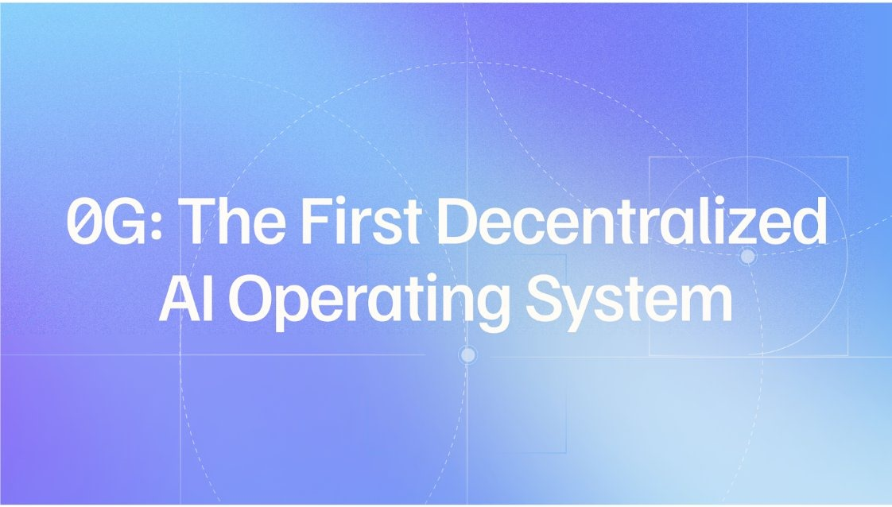
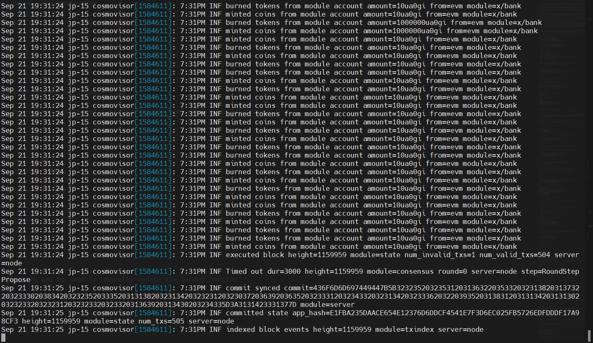

# 0G Testnet Guide

`will always update`

<p align="center">
  
</p>

- [0G Testnet Guide](#0g-testnet-guide)
- [ZeroGravity](#zerogravity)
  - [What Is 0G?](#what-is-0g)
  - [0G’s Architecture](#0gs-architecture)
  - [0G solving target](#0g-solving-target)
  - [Conclusion](#conclusion)
  - [Grand Valley's 0G public endpoints:](#grand-valleys-0g-public-endpoints)
  - [Valley of 0G. 0G tools created by Grand Valley](#valley-of-0g-0g-tools-created-by-grand-valley)
    - [Installation](#installation)
    - [Key Features of Valley of 0G](#key-features-of-valley-of-0g)
      - [1. Validator Nodes](#1-validator-nodes)
      - [2. Storage Nodes](#2-storage-nodes)
      - [3. Key-Value Storage Nodes](#3-key-value-storage-nodes)
      - [4. Automation \& Ease of Management](#4-automation--ease-of-management)
      - [5. Community-Focused Accessibility](#5-community-focused-accessibility)
  - [0G Validator Node Deployment Guide With Cosmovisor](#0g-validator-node-deployment-guide-with-cosmovisor)
    - [**System Requirements**](#system-requirements)
  - [Validator Node Manual installation](#validator-node-manual-installation)
    - [1. Install dependencies for building from source](#1-install-dependencies-for-building-from-source)
    - [2. install go](#2-install-go)
    - [3. install cosmovisor](#3-install-cosmovisor)
    - [4. set vars](#4-set-vars)
    - [5. download binary](#5-download-binary)
    - [6. config and init app](#6-config-and-init-app)
    - [7. set custom ports in config.toml file](#7-set-custom-ports-in-configtoml-file)
    - [8. Set custom ports in app.toml file](#8-set-custom-ports-in-apptoml-file)
    - [9. Download genesis.json](#9-download-genesisjson)
    - [10. Add seeds to the config.toml](#10-add-seeds-to-the-configtoml)
    - [11. Add peers to the config.toml](#11-add-peers-to-the-configtoml)
    - [12. Configure pruning to save storage (optional) (if you want to run a full node, skip this step)](#12-configure-pruning-to-save-storage-optional-if-you-want-to-run-a-full-node-skip-this-step)
    - [13. Open rpc endpoints](#13-open-rpc-endpoints)
    - [14. Open json-rpc endpoints (required for running the storage node and storage kv)](#14-open-json-rpc-endpoints-required-for-running-the-storage-node-and-storage-kv)
    - [15. Open api endpoints](#15-open-api-endpoints)
    - [16. set minimum gas price and enable prometheus](#16-set-minimum-gas-price-and-enable-prometheus)
    - [17. disable indexer (optional) (if u want to run a full node, skip this step)](#17-disable-indexer-optional-if-u-want-to-run-a-full-node-skip-this-step)
    - [18. initialize cosmovisor](#18-initialize-cosmovisor)
    - [19. define the path of cosmovisor](#19-define-the-path-of-cosmovisor)
      - [save the results, they'll be used in the next step](#save-the-results-theyll-be-used-in-the-next-step)
      - [this is an example of the result](#this-is-an-example-of-the-result)
    - [20. create service file](#20-create-service-file)
    - [21. start the node](#21-start-the-node)
    - [this is an example of the node is running well](#this-is-an-example-of-the-node-is-running-well)
    - [22. check node version](#22-check-node-version)
  - [you can use any snapshots and no need to manually update the node version](#you-can-use-any-snapshots-and-no-need-to-manually-update-the-node-version)
  - [Validator and key Commands](#validator-and-key-commands)
    - [1. create wallet](#1-create-wallet)
    - [2. check node synchronization](#2-check-node-synchronization)
    - [3. check your balance](#3-check-your-balance)
    - [4. create validator](#4-create-validator)
    - [5. BACKUP YOUR VALIDATOR ](#5-backup-your-validator-)
    - [6. delegate token to validator](#6-delegate-token-to-validator)
      - [self delegate](#self-delegate)
      - [delegate to ](#delegate-to-)
  - [delete the node](#delete-the-node)
- [CONTINUE TO STORAGE NODE](#continue-to-storage-node)
- [let's buidl together](#lets-buidl-together)

# ZeroGravity

## What Is 0G?

ZeroGravity (0G) is the first infinitely scalable, decentralized data availability layer featuring a built-in general-purpose storage system. This enables 0G to offer a highly scalable on-chain database suitable for various Web2 and Web3 data needs, including on-chain AI. Additionally, as a data availability layer, 0G ensures seamless verification of accurate data storage.



In the sections below, we will delve deeper into this architecture and explore the key use cases it unlocks.

## 0G’s Architecture

0G achieves high scalability by dividing the data availability workflow into two main lanes:

1. **Data Storage Lane**: This lane achieves horizontal scalability through data partitioning, allowing for rapid storage and access of large amounts of data.

2. **Data Publishing Lane**: This lane ensures data availability using a quorum-based system with an "honest majority" assumption, where the quorum is randomly selected via a Verifiable Random Function (VRF). This method avoids data broadcasting bottlenecks and supports larger data transfers in the Storage Lane.

0G Storage is an on-chain database made up of Storage Nodes that participate in a Proof of Random Access (PoRA) mining process. Nodes are rewarded for correctly responding to random data queries, promoting network participation and scalability.

0G DA (Data Availability) Layer is built on 0G Storage and uses a quorum-based architecture for data availability confirmation. The system relies on an honest majority of nodes, with quorum selection randomized by VRF and GPUs enhancing the erasure coding process for data storage.

## 0G solving target

The increasing need for greater Layer 2 (L2) scalability has coincided with the rise of Data Availability Layers (DALs), which are essential for addressing Ethereum's scaling challenges. L2s handle transactions off-chain and settle on Ethereum for security, requiring transaction data to be posted somewhere for validation. By publishing data directly on Ethereum, high fees are distributed among L2 users, enhancing scalability.

DALs offer a more efficient method for publishing and maintaining off-chain data for inspection. However, existing DALs struggle to manage the growing volume of on-chain data, especially for data-intensive applications like on-chain AI, due to limited storage capacity and throughput.

0G offers a solution with a 1,000x performance improvement over Ethereum's danksharding and a 4x improvement over Solana's Firedancer, providing the infrastructure needed for massive Web3 data scalability. Key applications of 0G include:

1. **AI**: 0G Storage can handle large datasets, and 0G DA enables the rapid deployment of AI models on-chain.
2. **L1s / L2s**: These networks can use 0G for data availability and storage, with partners like Polygon, Arbitrum, Fuel, and Manta Network.
3. **Bridges**: Networks can store their state using 0G, facilitating secure cross-chain transfers by storing and communicating user balances.
4. **Rollups-as-a-Service (RaaS)**: 0G provides DA and storage infrastructure for RaaS providers like Caldera and AltLayer.
5. **DeFi**: 0G's scalable DA supports efficient DeFi on specific L2s and L3s, enabling fast settlement and high-frequency trading.
6. **On-chain Gaming**: Gaming requires reliable storage of cryptographic proofs and metadata, such as player assets and actions.
7. **Data Markets**: Web3 data markets can store their data on-chain, feasible on a large scale with 0G.

## Conclusion

0G is a scalable, low-cost, and programmable DA solution essential for bringing vast amounts of data on-chain. Its role as an on-chain data storage solution unlocks numerous use cases, providing the database infrastructure for any on-chain application. 0G efficiently stores and proves the availability of any Web2 or Web3 data, extending benefits beyond confirming L2 transactions.

For more detailed information, visit the [0G DA documentation](https://docs.0g.ai/0g-doc/docs/0g-da)

With Public Testnet, 0G’s docs and code become public. Check them out below! -

- [0gchain Website](https://0g.ai/)
- [0gchain X](https://x.com/0G_labs)
- [0gchain Discord](https://discord.com/invite/0glabs)
- [0gchain Docs](https://docs.0g.ai/0g-doc)
- [0gchain Github](https://github.com/0glabs)
- [0gchain Explorer](https://explorer.grandvalleys.com/0g-chain%20testnet)

## Grand Valley's 0G public endpoints:

- cosmos rpc: `https://lightnode-rpc-0g.grandvalleys.com`
- json-rpc: `https://lightnode-json-rpc-0g.grandvalleys.com`
- cosmos rest-api: `https://lightnode-api-0g.grandvalleys.com`
- peer: `65f62fc8e46ff89f7960bc30e2fc1c0e4a846340@peer-0g.grandvalleys.com:26656$`

## Valley of 0G. 0G tools created by Grand Valley


**Valley of 0G** by Grand Valley is an all-in-one solution for managing nodes within the **0G** decentralized AI network. It provides easy tools to deploy, monitor, and maintain validator and storage nodes, making it simple to manage AI-focused infrastructure. Designed for scalability and performance, **Valley of 0G** helps efficiently manage data and resources, all within a community-driven environment with public support and endpoints.

### Installation

Run the following command to install Valley of 0G:

```bash
bash <(curl -s https://raw.githubusercontent.com/hubofvalley/Testnet-Guides/main/0g%20\(zero-gravity\)/resources/valleyof0G.sh)
```

### Key Features of Valley of 0G

#### 1. Validator Nodes

- **High-Performance Validation**: Deploy powerful validator nodes to secure the 0G network, optimized for transaction consistency and processing speed.

#### 2. Storage Nodes

- **Decentralized Data Storage**: Use fast NVMe SSDs for storing 0G network data, ensuring data remains accessible and reliable within a decentralized infrastructure.

#### 3. Key-Value Storage Nodes

- **Specialized Data Handling**: Operate nodes focused on key-value data storage to support real-time access and structured data needs within 0G, ideal for applications requiring rapid data retrieval and streaming.

#### 4. Automation & Ease of Management

- **Automated Node Management**: Utilize scripts for efficient deployment, updates, and maintenance, making node management straightforward and minimizing manual effort.

#### 5. Community-Focused Accessibility

- **Public Endpoints and Support**: Benefit from open endpoints and active social channels that enable developers and users to connect, access resources, and participate in the 0G community.

## 0G Validator Node Deployment Guide With Cosmovisor

### **System Requirements**

| Category  | Requirements                   |
| --------- | ------------------------------ |
| CPU       | 8 cores                        |
| RAM       | 64+ GB                         |
| Storage   | 1+ TB NVMe SSD                 |
| Bandwidth | 100 MBps for Download / Upload |

- guide's current binaries version: `v0.2.5 will automatically update to the latest version`
- service file name: `0gchaind.service`
- current chain : `zgtendermint_16600-2`

## Validator Node Manual installation

### 1. Install dependencies for building from source

```bash
sudo apt update -y && sudo apt upgrade -y && \
sudo apt install -y curl git jq build-essential gcc unzip wget lz4 openssl \
libssl-dev pkg-config protobuf-compiler clang cmake llvm llvm-dev
```

### 2. install go

```bash
cd $HOME && ver="1.22.0" && \
wget "https://golang.org/dl/go$ver.linux-amd64.tar.gz" && \
sudo rm -rf /usr/local/go && sudo tar -C /usr/local -xzf "go$ver.linux-amd64.tar.gz" && \
rm "go$ver.linux-amd64.tar.gz" && \
echo 'export PATH=$PATH:/usr/local/go/bin:$HOME/go/bin' >> ~/.bash_profile && \
source ~/.bash_profile && go version
```

### 3. install cosmovisor

```bash
go install cosmossdk.io/tools/cosmovisor/cmd/cosmovisor@latest
```

### 4. set vars

ENTER YOUR MONIKER & YOUR PREFERRED PORT NUMBER

```bash
read -p "Enter your moniker: " MONIKER && echo "Current moniker: $MONIKER"
read -p "Enter your 2 digits custom port: (leave empty to use default: 26) " OG_PORT && echo "Current port number: ${OG_PORT:-26}"
read -p "Enter your wallet name: " WALLET && echo "Current wallet name: $WALLET"

echo "export WALLET=\"$WALLET\"" >> $HOME/.bash_profile
echo "export MONIKER=\"$MONIKER\"" >> $HOME/.bash_profile
echo "export OG_CHAIN_ID=\"zgtendermint_16600-2\"" >> $HOME/.bash_profile
echo "export OG_PORT=\"${OG_PORT:-26}\"" >> $HOME/.bash_profile
source $HOME/.bash_profile
```

### 5. download binary

```bash
git clone -b v0.2.5 https://github.com/0glabs/0g-chain.git
cd 0g-chain
make install
0gchaind version
```

### 6. config and init app

```bash
cd $HOME
0gchaind init $MONIKER --chain-id $OG_CHAIN_ID
0gchaind config chain-id $OG_CHAIN_ID
0gchaind config node tcp://localhost:${OG_PORT}657
0gchaind config keyring-backend os
```

### 7. set custom ports in config.toml file

```bash
sed -i.bak -e "s%laddr = \"tcp://0.0.0.0:26656\"%laddr = \"tcp://0.0.0.0:${OG_PORT}656\"%;
s%prometheus_listen_addr = \":26660\"%prometheus_listen_addr = \":${OG_PORT}660\"%;
s%proxy_app = \"tcp://127.0.0.1:26658\"%proxy_app = \"tcp://127.0.0.1:${OG_PORT}658\"%;
s%laddr = \"tcp://127.0.0.1:26657\"%laddr = \"tcp://0.0.0.0:${OG_PORT}657\"%;
s%^pprof_laddr = \"localhost:26060\"%pprof_laddr = \"localhost:${OG_PORT}060\"%" $HOME/.0gchain/config/config.toml
```

### 8. Set custom ports in app.toml file

```bash
sed -i.bak -e "s%address = \"tcp://0.0.0.0:1317\"%address = \"tcp://0.0.0.0:${OG_PORT}317\"%;
s%address = \"127.0.0.1:8545\"%address = \"127.0.0.1:${OG_PORT}545\"%;
s%ws-address = \"127.0.0.1:8546\"%ws-address = \"127.0.0.1:${OG_PORT}546\"%;
s%metrics-address = \"127.0.0.1:6065\"%metrics-address = \"127.0.0.1:${OG_PORT}065\"%" $HOME/.0gchain/config/app.toml
```

### 9. Download genesis.json

```bash
sudo rm $HOME/.0gchain/config/genesis.json && \
wget https://github.com/0glabs/0g-chain/releases/download/v0.2.3/genesis.json -O $HOME/.0gchain/config/genesis.json
```

### 10. Add seeds to the config.toml

```bash
SEEDS="81987895a11f6689ada254c6b57932ab7ed909b6@54.241.167.190:26656,010fb4de28667725a4fef26cdc7f9452cc34b16d@54.176.175.48:26656,e9b4bc203197b62cc7e6a80a64742e752f4210d5@54.193.250.204:26656,68b9145889e7576b652ca68d985826abd46ad660@18.166.164.232:26656,8f21742ea5487da6e0697ba7d7b36961d3599567@og-testnet-seed.itrocket.net:47656" && \
sed -i.bak -e "s/^seeds *=.*/seeds = \"${SEEDS}\"/" $HOME/.0gchain/config/config.toml
```

### 11. Add peers to the config.toml

```bash
peers=$(curl -sS https://lightnode-rpc-0g.grandvalleys.com/net_info | jq -r '.result.peers[] | "\(.node_info.id)@\(.remote_ip):\(.node_info.listen_addr)"' | awk -F ':' '{print $1":"$(NF)}' | paste -sd, -)
echo $peers
sed -i -e "s|^persistent_peers *=.*|persistent_peers = \"$peers\"|" $HOME/.0gchain/config/config.toml
```

### 12. Configure pruning to save storage (optional) (if you want to run a full node, skip this step)

```bash
sed -i \
   -e "s/^pruning *=.*/pruning = \"custom\"/" \
   -e "s/^pruning-keep-recent *=.*/pruning-keep-recent = \"100\"/" \
   -e "s/^pruning-interval *=.*/pruning-interval = \"50\"/" \
   "$HOME/.0gchain/config/app.toml"
```

### 13. Open rpc endpoints

```bash
sed -i \
   -e "s/laddr = \"tcp:\/\/127.0.0.1:${OG_PORT}657\"/laddr = \"tcp:\/\/0.0.0.0:${OG_PORT}657\"/" \
   $HOME/.0gchain/config/config.toml
```

### 14. Open json-rpc endpoints (required for running the storage node and storage kv)

```bash
sed -i \
   -e 's/address = "127.0.0.1:${OG_PORT}545"/address = "0.0.0.0:${OG_PORT}545"/' \
   -e 's|^api = ".*"|api = "eth,txpool,personal,net,debug,web3"|' \
   -e 's/logs-cap = 10000/logs-cap = 20000/' \
   -e 's/block-range-cap = 10000/block-range-cap = 20000/' \
   $HOME/.0gchain/config/app.toml
```

### 15. Open api endpoints

```bash
sed -i \
   -e '/^\[api\]/,/^\[/ s/^enable = .*/enable = true/' \
   $HOME/.0gchain/config/app.toml
```

### 16. set minimum gas price and enable prometheus

```bash
sed -i "s/^minimum-gas-prices *=.*/minimum-gas-prices = \"0ua0gi\"/" $HOME/.0gchain/config/app.toml
sed -i -e "s/prometheus = false/prometheus = true/" $HOME/.0gchain/config/config.toml
```

### 17. disable indexer (optional) (if u want to run a full node, skip this step)

```bash
sed -i -e "s/^indexer *=.*/indexer = \"null\"/" $HOME/.0gchain/config/config.toml
```

### 18. initialize cosmovisor

```bash
echo "export DAEMON_NAME=0gchaind" >> $HOME/.bash_profile
echo "export DAEMON_HOME=$(find $HOME -type d -name ".0gchain" -print -quit)" >> $HOME/.bash_profile
source $HOME/.bash_profile
cosmovisor init $HOME/go/bin/0gchaind
cd $HOME/go/bin/
sudo rm -r $HOME/go/bin/0gchaind
ln -s $HOME/.0gchain/cosmovisor/current/bin/0gchaind 0gchaind
sudo chown -R $USER:$USER $HOME/go/bin/0gchaind
sudo chmod +x $HOME/go/bin/0gchaind
mkdir -p $HOME/.0gchain/cosmovisor/upgrades
mkdir -p $HOME/.0gchain/cosmovisor/backup
```

### 19. define the path of cosmovisor

```bash
input1=$(which cosmovisor)
input2=$(find $HOME -type d -name ".0gchain")
input3=$(find $HOME/.0gchain/cosmovisor -type d -name "backup")
echo "export DAEMON_NAME=0gchaind" >> $HOME/.bash_profile
echo "export DAEMON_HOME=$input2" >> $HOME/.bash_profile
echo "export DAEMON_DATA_BACKUP_DIR=$(find $HOME/.0gchain/cosmovisor -type d -name "backup")" >> $HOME/.bash_profile
source $HOME/.bash_profile
echo "input1. $input1"
echo "input2. $input2"
echo "input3. $input3"
```

#### save the results, they'll be used in the next step

#### this is an example of the result


### 20. create service file

```bash
sudo tee /etc/systemd/system/0gchaind.service > /dev/null <<EOF
[Unit]
Description=Cosmovisor 0G Node
After=network.target

[Service]
User=$USER
Type=simple
WorkingDirectory=$HOME/.0gchain
ExecStart=$input1 run start --log_output_console
Restart=on-failure
LimitNOFILE=65535
Environment="DAEMON_NAME=0gchaind"
Environment="DAEMON_HOME=$input2"
Environment="DAEMON_ALLOW_DOWNLOAD_BINARIES=true"
Environment="DAEMON_RESTART_AFTER_UPGRADE=true"
Environment="DAEMON_DATA_BACKUP_DIR=$input3"
Environment="UNSAFE_SKIP_BACKUP=true"

[Install]
WantedBy=multi-user.target
EOF
```

### 21. start the node

```bash
sudo systemctl daemon-reload && \
sudo systemctl enable 0gchaind && \
sudo systemctl restart 0gchaind && \
sudo journalctl -u 0gchaind -fn 100
```

### this is an example of the node is running well



### 22. check node version

```bash
cosmovisor run version
```

## you can use any snapshots and no need to manually update the node version

## Validator and key Commands

### 1. create wallet

```bash
0gchaind keys add $WALLET --eth
```


query the 0x address

```bash
echo "0x$(0gchaind debug addr $(0gchaind keys show $WALLET -a) | grep hex | awk '{print $3}')"
```

THEN U MUST REQUEST THE TEST TOKEN FROM THE [FAUCET](https://faucet.0g.ai/) BY ENTERING YOUR 0X ADDRESS

OR YOU CAN IMPORT YOUR EXISTING WALLET

```bash
0gchaind keys add $WALLET --recover --keyring-backend os --eth
```

### 2. check node synchronization

```bash
0gchaind status | jq .sync_info
```

make sure your node block height has been synced with the latest block height. or you can check the `catching_up` value must be `false`

### 3. check your balance

```bash
0gchaind q bank balances $(0gchaind keys show $WALLET -a)
```

### 4. create validator

EDIT YOUR IDENTITY, WEBSITE URL, YOUR MAIL AND YOUR DETAILS. BUT THOSE ARE OPTIONAL

```bash
0gchaind tx staking create-validator \
--amount=1000000ua0gi \
--pubkey=$(0gchaind tendermint show-validator) \
--moniker=$MONIKER \
--chain-id=$OG_CHAIN_ID \
--commission-rate=0.10 \
--commission-max-rate=0.20 \
--commission-max-change-rate=0.01 \
--min-self-delegation=1 \
--from=$WALLET \
--identity=<your-identity> \
--website=<your-website-url> \
--security-contact=<your-mail> \
--details="let's buidl 0g together" \
--gas auto \
 --gas-adjustment 1.4 \
-y
```

`1uaogi = (10)^(-6)AOGI = 0.000001AOGI`

### 5. BACKUP YOUR VALIDATOR 

```bash
nano /$HOME/.0gchain/config/priv_validator_key.json
```

```bash
nano /$HOME/.0gchain/data/priv_validator_state.json
```

copy all of the contents of the  !and  files and save them in a safe place. This is a vital step in case you need to migrate your validator node

### 6. delegate token to validator

#### self delegate

```bash
0gchaind tx staking delegate $(0gchaind keys show $WALLET --bech val -a) 1000000ua0gi --from $WALLET --chain-id zgtendermint_16600-2 --gas auto --gas-adjustment 1.4 -y
```

#### delegate to <a href="https://explorer.grandvalleys.com/0g-chain%20testnet/staking/0gvaloper1gela3jtnmen0dmj2q5p0pne5y45ftshzs053x3">

</a>

```bash
0gchaind tx staking delegate 0gvaloper1gela3jtnmen0dmj2q5p0pne5y45ftshzs053x3 1000000ua0gi --from $WALLET --chain-id zgtendermint_16600-2 --gas auto --gas-adjustment 1.4 -y
```

## delete the node

```bash
sudo systemctl stop 0gchaind
sudo systemctl disable 0gchaind
sudo rm -rf /etc/systemd/system/0gchaind.service
sudo rm -r 0g-chain
sudo rm -rf $HOME/.0gchain
sed -i "/OG_/d" $HOME/.bash_profile
```

# [CONTINUE TO STORAGE NODE](https://github.com/hubofvalley/Testnet-Guides/blob/main/0g%20(zero-gravity)/storage-node.md)

# let's buidl together
