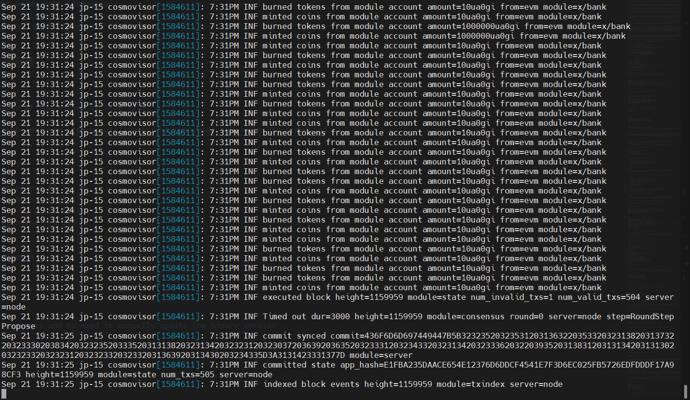

# 0gchain Testnet Guide
```will always update```

## 0gchain

- **WHAT IS 0gchain?** 
ZeroGravity (0G) is the first infinitely scalable, decentralized data availability layer featuring a built-in general-purpose storage system. This enables 0G to offer a highly scalable on-chain database suitable for various Web2 and Web3 data needs, including on-chain AI. Additionally, as a data availability layer, 0G ensures seamless verification of accurate data storage.

In the sections below, we will delve deeper into this architecture and explore the key use cases it unlocks.

- **0G’s Architecture**
0G achieves high scalability by dividing the data availability workflow into two main lanes:

  1. **Data Storage Lane**: This lane achieves horizontal scalability through data partitioning, allowing for rapid storage and access of large amounts of data.

  2. **Data Publishing Lane**: This lane ensures data availability using a quorum-based system with an "honest majority" assumption, where the quorum is randomly selected via a Verifiable Random Function (VRF). This method avoids data broadcasting bottlenecks and supports larger data transfers in the Storage Lane.

0G Storage is an on-chain database made up of Storage Nodes that participate in a Proof of Random Access (PoRA) mining process. Nodes are rewarded for correctly responding to random data queries, promoting network participation and scalability.

0G DA (Data Availability) Layer is built on 0G Storage and uses a quorum-based architecture for data availability confirmation. The system relies on an honest majority of nodes, with quorum selection randomized by VRF and GPUs enhancing the erasure coding process for data storage.



- **0G solving target**
The increasing need for greater Layer 2 (L2) scalability has coincided with the rise of Data Availability Layers (DALs), which are essential for addressing Ethereum's scaling challenges. L2s handle transactions off-chain and settle on Ethereum for security, requiring transaction data to be posted somewhere for validation. By publishing data directly on Ethereum, high fees are distributed among L2 users, enhancing scalability.

DALs offer a more efficient method for publishing and maintaining off-chain data for inspection. However, existing DALs struggle to manage the growing volume of on-chain data, especially for data-intensive applications like on-chain AI, due to limited storage capacity and throughput.

0G offers a solution with a 1,000x performance improvement over Ethereum's danksharding and a 4x improvement over Solana's Firedancer, providing the infrastructure needed for massive Web3 data scalability. Key applications of 0G include:

1. **AI**: 0G Storage can handle large datasets, and 0G DA enables the rapid deployment of AI models on-chain.
2. **L1s / L2s**: These networks can use 0G for data availability and storage, with partners like Polygon, Arbitrum, Fuel, and Manta Network.
3. **Bridges**: Networks can store their state using 0G, facilitating secure cross-chain transfers by storing and communicating user balances.
4. **Rollups-as-a-Service (RaaS)**: 0G provides DA and storage infrastructure for RaaS providers like Caldera and AltLayer.
5. **DeFi**: 0G's scalable DA supports efficient DeFi on specific L2s and L3s, enabling fast settlement and high-frequency trading.
6. **On-chain Gaming**: Gaming requires reliable storage of cryptographic proofs and metadata, such as player assets and actions.
7. **Data Markets**: Web3 data markets can store their data on-chain, feasible on a large scale with 0G.

0G is a scalable, low-cost, and programmable DA solution essential for bringing vast amounts of data on-chain. Its role as an on-chain data storage solution unlocks numerous use cases, providing the database infrastructure for any on-chain application. 0G efficiently stores and proves the availability of any Web2 or Web3 data, extending benefits beyond confirming L2 transactions.

For more detailed information, visit the [0G DA documentation](https://docs.0g.ai/0g-doc/docs/0g-da)

With Public Testnet, 0gchain’s docs and code become public. Check them out below!
    - [0gchainWebsite](https://0g.ai/)
    - [0gchainX](https://x.com/0G_labs)
    - [0gchainDiscord](https://discord.com/invite/0glabs)
    - [0gchainDocs](https://docs.0g.ai/0g-doc)
    - [0gchainGithub](https://github.com/0glabs)
    - [0gchainExplorer - 0gchaintion-1](https://testnet.blockhub.id/0gchain)

## 0gchain Node Deployment Guide

### 1. Install dependencies for building from source
   ```bash
    sudo apt update && \
    sudo apt install curl git jq build-essential gcc unzip wget lz4 openssl -y
   ```

### 2. install go
   ```bash
   cd $HOME
   VER="1.22.2"
   wget "https://golang.org/dl/go$VER.linux-amd64.tar.gz"sudo rm -rf /usr/local/go
   sudo tar -C /usr/local -xzf "go$VER.linux-amd64.tar.gz"
   rm "go$VER.linux-amd64.tar.gz"
   [ ! -f ~/.bash_profile ] && touch ~/.bash_profile
   echo "export PATH=$PATH:/usr/local/go/bin:~/go/bin" >> ~/.bash_profile
   source $HOME/.bash_profile
   [ ! -d ~/go/bin ] && mkdir -p ~/go/bin
   ```

### 3. install rustup
    ```
    curl --proto '=https' --tlsv1.2 -sSf https://sh.rustup.rs | sh
    ```

### 4. set vars
   ```bash
    echo 'export ZGS_CONFIG_FILE="$HOME/0g-storage-node/run/config.toml"' >> ~/.bash_profile
    echo 'export ZGS_LOG_DIR="$HOME/0g-storage-node/run/log"' >> ~/.bash_profile
    echo 'export ZGS_LOG_CONFIG_FILE="$HOME/0g-storage-node/run/log_config"' >> ~/.bash_profile

    source ~/.bash_profile
   ```

### 4. download binary
   ```bash
    cd $HOME
    git clone https://github.com/0glabs/0g-storage-node.git
    cd 0g-storage-node
    git checkout tags/v1.0.0-testnet
    git submodule update --init
    cargo build --release
    sudo mv $HOME/0g-storage-node/target/release/zgs_node /usr/local/bin
   ```

### 5. wallet setup
obtain yout wallet's private key by using this command :

   ```bash
    0gchaind keys unsafe-export-eth-key $WALLET_NAME
   ```

store your private key in variable:

   ```bash
   read -sp "Enter your private key: " PRIVATE_KEY && echo
   ```

### 6. update node configuration
   ```bash
    if grep -q '# miner_id' $ZGS_CONFIG_FILE; then
        MINER_ID=$(openssl rand -hex 32)
        sed -i "/# miner_id/c\miner_id = \"$MINER_ID\"" $ZGS_CONFIG_FILE
    fi

    if grep -q '# miner_key' $ZGS_CONFIG_FILE; then
        sed -i "/# miner_key/c\miner_key = \"$PRIVATE_KEY\"" $ZGS_CONFIG_FILE
    fi

    sed -i "s|^log_config_file =.*$|log_config_file = \"$ZGS_LOG_CONFIG_FILE\"|" $ZGS_CONFIG_FILE

    if ! grep -q "^log_directory =" "$ZGS_CONFIG_FILE"; then
        echo "log_directory = \"$ZGS_LOG_DIR\"" >> "$ZGS_CONFIG_FILE"
    fi
   ```

### 7. create service
   ```bash
   sudo tee /etc/systemd/system/zgs.service > /dev/null <<EOF
[Unit]
Description=0G Storage Node
After=network.target

[Service]
User=$USER
Type=simple
ExecStart=zgs_node --config $ZGS_CONFIG_FILE
Restart=on-failure
LimitNOFILE=65535

[Install]
WantedBy=multi-user.target
EOF
   ```
### 8. start the node
   ```bash
    sudo systemctl daemon-reload && \
    sudo systemctl enable zgs && \
    sudo systemctl restart zgs && \
    sudo systemctl status zgs
   ```

### 9. show logs by date
   ```bash
   ls -lt $ZGS_LOG_DIR
   ```
