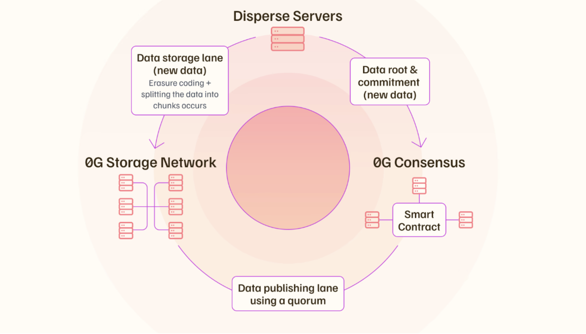

# 0gchain Storage Node Deployment Guide

- [0gchain Storage Node Deployment Guide](#0gchain-storage-node-deployment-guide)
    - [**System Requirements**](#system-requirements)
    - [1. Install dependencies for building from source](#1-install-dependencies-for-building-from-source)
    - [2. install go](#2-install-go)
    - [3. install rustup](#3-install-rustup)
    - [4. set vars](#4-set-vars)
      - [ALSO CHECK THE JSON-RPC SYNC, MAKE SURE IT'S IN THE LATEST BLOCK](#also-check-the-json-rpc-sync-make-sure-its-in-the-latest-block)
    - [5. download binary](#5-download-binary)
    - [6. check the storage node version](#6-check-the-storage-node-version)
    - [7. wallet private key check](#7-wallet-private-key-check)
    - [8. update node configuration](#8-update-node-configuration)
      - [TURBO CONTRACT](#turbo-contract)
      - [STANDARD CONTRACT](#standard-contract)
    - [9. create service](#9-create-service)
    - [10. start the node](#10-start-the-node)
    - [11. show logs by date](#11-show-logs-by-date)
    - [delete storage node](#delete-storage-node)
  - [update the storage node to v0.6.0 (in case you're still in the previous version)](#update-the-storage-node-to-v060-in-case-youre-still-in-the-previous-version)
    - [1. stop storage node](#1-stop-storage-node)
    - [2. update node](#2-update-node)
    - [3. build the latest binary](#3-build-the-latest-binary)
    - [4. set vars](#4-set-vars-1)
    - [5. store your private key in variable:](#5-store-your-private-key-in-variable)
    - [6. update node configuration](#6-update-node-configuration)
      - [TURBO CONTRACT](#turbo-contract-1)
      - [STANDARD CONTRACT](#standard-contract-1)
    - [7. restart the node](#7-restart-the-node)
    - [8. show the logs](#8-show-the-logs)
- [CONTINUE TO STORAGE KV](#continue-to-storage-kv)
- [let's buidl together](#lets-buidl-together)



### **System Requirements**

| Category  | Requirements                   |
| --------- | ------------------------------ |
| CPU       | 8+ cores                       |
| RAM       | 32+ GB                         |
| Storage   | 500GB / 1TB NVMe SSD           |
| Bandwidth | 100 MBps for Download / Upload |

guide's current binary version: `v0.6.1`

### 1. Install dependencies for building from source

```bash
sudo apt-get update -y
sudo apt-get install clang cmake build-essential -y
sudo apt install git -y
sudo apt install libssl-dev -y
sudo apt install pkg-config -y
sudo apt-get install protobuf-compiler -y
sudo apt-get install clang -y
sudo apt-get install llvm llvm-dev -y
```

### 2. install go

```bash
cd $HOME && \
ver="1.22.0" && \
wget "https://golang.org/dl/go$ver.linux-amd64.tar.gz" && \
sudo rm -rf /usr/local/go && \
sudo tar -C /usr/local -xzf "go$ver.linux-amd64.tar.gz" && \
rm "go$ver.linux-amd64.tar.gz" && \
echo "export PATH=$PATH:/usr/local/go/bin:$HOME/go/bin" >> ~/.bash_profile && \
source ~/.bash_profile && \
go version
```

### 3. install rustup

```bash
curl --proto '=https' --tlsv1.2 -sSf https://sh.rustup.rs | sh
```

### 4. set vars

PLEASE INPUT YOUR OWN JSON-RPC ENDPOINT (http://VALIDATOR_NODE_IP:8545). OR U CAN USE ONE OF THESE RPCS

`https://evmrpc-testnet.0g.ai`
`https://rpc.ankr.com/0g_newton`
`https://16600.rpc.thirdweb.com`
`https://0g-json-rpc-public.originstake.com`
`https://0g-rpc-evm01.validatorvn.com`
`https://og-testnet-jsonrpc.itrocket.net:443`
`https://0g-evmrpc-zstake.xyz`
`https://zerog-testnet-json-rpc.contributiondao.com`

```bash
read -p "Enter json-rpc: " BLOCKCHAIN_RPC_ENDPOINT && echo "Current json-rpc: $BLOCKCHAIN_RPC_ENDPOINT"
```

```bash
echo "export ENR_ADDRESS=${ENR_ADDRESS}" >> ~/.bash_profile
echo 'export ZGS_LOG_DIR="$HOME/0g-storage-node/run/log"' >> ~/.bash_profile
echo 'export ZGS_LOG_SYNC_BLOCK="595059"' >> ~/.bash_profile
echo "export BLOCKCHAIN_RPC_ENDPOINT=\"$BLOCKCHAIN_RPC_ENDPOINT\"" >> ~/.bash_profile

source ~/.bash_profile

echo -e "\n\033[31mCHECK YOUR STORAGE NODE VARIABLES\033[0m\nZGS_LOG_SYNC_BLOCK: $ZGS_LOG_SYNC_BLOCK\nBLOCKCHAIN_RPC_ENDPOINT: $BLOCKCHAIN_RPC_ENDPOINT\n\n" "\033[3m\"lets buidl together\" - Grand Valley\033[0m"
```

#### ALSO CHECK THE JSON-RPC SYNC, MAKE SURE IT'S IN THE LATEST BLOCK

```bash
curl -s -X POST $BLOCKCHAIN_RPC_ENDPOINT -H "Content-Type: application/json" -d '{"jsonrpc":"2.0","method":"eth_blockNumber","params":[],"id":1}' | jq -r '.result' | xargs printf "%d\n"
```

### 5. download binary

```bash
cd $HOME
git clone -b v0.6.1 https://github.com/0glabs/0g-storage-node.git
cd $HOME/0g-storage-node
git stash
git fetch --all --tags
git checkout f4d5228234258ef4c9f8b2b83d80911fa38a6db9
git submodule update --init
```

then build it

```bash
cargo build --release
```

### 6. check the storage node version

```bash
$HOME/0g-storage-node/target/release/zgs_node --version
```

### 7. wallet private key check

obtain yout wallet's private key by using this command in your validator node :

```bash
0gchaind keys unsafe-export-eth-key $WALLET
```

store your private key in variable:

```bash
read -p "Enter your private key: " PRIVATE_KEY && echo "private key: $PRIVATE_KEY"
```

### 8. update node configuration

#### TURBO CONTRACT

```bash
rm -rf $HOME/0g-storage-node/run/config-testnet.toml && cp $HOME/0g-storage-node/run/config-testnet-turbo.toml $HOME/0g-storage-node/run/config-testnet.toml
```

#### STANDARD CONTRACT

```bash
rm -rf $HOME/0g-storage-node/run/config-testnet.toml && cp $HOME/0g-storage-node/run/config-testnet-standard.toml $HOME/0g-storage-node/run/config-testnet.toml
```

```bash
sed -i "
s|^\s*#\s*miner_key\s*=.*|miner_key = \"$PRIVATE_KEY\"|
s|^\s*#\s*listen_address\s*=.*|listen_address = \"0.0.0.0:5678\"|
s|^\s*#\s*listen_address_admin\s*=.*|listen_address_admin = \"0.0.0.0:5679\"|
s|^\s*#\?\s*rpc_enabled\s*=.*|rpc_enabled = true|
s|^\s*#\?\s*log_sync_start_block_number\s*=.*|log_sync_start_block_number = $ZGS_LOG_SYNC_BLOCK|
s|^\s*#\?\s*blockchain_rpc_endpoint\s*=.*|blockchain_rpc_endpoint = \"$BLOCKCHAIN_RPC_ENDPOINT\"|
" $HOME/0g-storage-node/run/config-testnet.toml
```

### 9. create service

```bash
sudo tee /etc/systemd/system/zgs.service > /dev/null <<EOF
[Unit]
Description=ZGS Node
After=network.target

[Service]
User=$USER
WorkingDirectory=$HOME/0g-storage-node/run
ExecStart=$HOME/0g-storage-node/target/release/zgs_node --config $HOME/0g-storage-node/run/config-testnet.toml
Restart=on-failure
RestartSec=10
LimitNOFILE=65535

[Install]
WantedBy=multi-user.target
EOF
```

### 10. start the node

```bash
sudo systemctl daemon-reload && \
sudo systemctl enable zgs && \
sudo systemctl restart zgs && \
sudo systemctl status zgs
```

### 11. show logs by date

- full logs command

```bash
tail -f ~/0g-storage-node/run/log/zgs.log.$(TZ=UTC date +%Y-%m-%d)
```

- tx_seq-only logs command

```bash
tail -f ~/0g-storage-node/run/log/zgs.log.$(TZ=UTC date +%Y-%m-%d) | grep tx_seq:
```

MAKE SURE YOUR LOGS HAS THE INCREASING TX_SEQ VALUE


WAIT UNTIL IT SYNCED TO THE LATEST TX_SEQ NUMBER ON THE [OG STORAGE SCAN](https://storagescan-newton.0g.ai/)


- minimized-logs command

```bash
tail -f ~/0g-storage-node/run/log/zgs.log.$(TZ=UTC date +%Y-%m-%d) | grep -v "discv5\|network\|connect\|16U\|nounce"
```

- check your storage node through rpc

```bash
curl -X POST http://localhost:5678 -H "Content-Type: application/json" -d '{"jsonrpc":"2.0","method":"zgs_getStatus","params":[],"id":1}'  | jq
```

### delete storage node

```bash
sudo systemctl stop zgs
sudo systemctl disable zgs
sudo rm /etc/systemd/system/zgs.service
sudo rm -rf $HOME/0g-storage-node
```

## update the storage node to v0.6.0 (in case you're still in the previous version)

### 1. stop storage node

```bash
sudo systemctl stop zgs
```

### 2. update node

```bash
cd $HOME/0g-storage-node
git stash
git fetch --all --tags
git checkout 8f17a7ad722f417a77fab85bf0a1e2e406b7bb50
git submodule update --init
```

### 3. build the latest binary

```bash
cargo build --release
```

### 4. set vars

PLEASE INPUT YOUR OWN JSON-RPC ENDPOINT (http://VALIDATOR_NODE_IP:8545). OR U CAN USE ONE OF THESE RPCS

`https://evmrpc-testnet.0g.ai`
`https://rpc.ankr.com/0g_newton`
`https://16600.rpc.thirdweb.com`
`https://0g-json-rpc-public.originstake.com`
`https://0g-rpc-evm01.validatorvn.com`
`https://og-testnet-jsonrpc.itrocket.net:443`
`https://0g-evmrpc-zstake.xyz`
`https://zerog-testnet-json-rpc.contributiondao.com`

```bash
read -p "Enter json-rpc: " BLOCKCHAIN_RPC_ENDPOINT && echo "Current json-rpc: $BLOCKCHAIN_RPC_ENDPOINT"
```

```bash
echo "export ENR_ADDRESS=${ENR_ADDRESS}" >> ~/.bash_profile
echo 'export ZGS_LOG_DIR="$HOME/0g-storage-node/run/log"' >> ~/.bash_profile
echo 'export ZGS_LOG_SYNC_BLOCK="595059"' >> ~/.bash_profile
echo "export BLOCKCHAIN_RPC_ENDPOINT=\"$BLOCKCHAIN_RPC_ENDPOINT\"" >> ~/.bash_profile

source ~/.bash_profile

echo -e "\n\033[31mCHECK YOUR STORAGE NODE VARIABLES\033[0m\nZGS_LOG_SYNC_BLOCK: $ZGS_LOG_SYNC_BLOCK\nBLOCKCHAIN_RPC_ENDPOINT: $BLOCKCHAIN_RPC_ENDPOINT\n\n" "\033[3m\"lets buidl together\" - Grand Valley\033[0m"
```

### 5. store your private key in variable:

```bash
read -p "Enter your private key: " PRIVATE_KEY && echo "private key: $PRIVATE_KEY"
```

### 6. update node configuration

#### TURBO CONTRACT

```bash
rm -rf $HOME/0g-storage-node/run/config-testnet.toml && cp $HOME/0g-storage-node/run/config-testnet-turbo.toml $HOME/0g-storage-node/run/config-testnet.toml
```

#### STANDARD CONTRACT

```bash
rm -rf $HOME/0g-storage-node/run/config-testnet.toml && cp $HOME/0g-storage-node/run/config-testnet-standard.toml $HOME/0g-storage-node/run/config-testnet.toml
```

```bash
sed -i "
s|^\s*#\s*miner_key\s*=.*|miner_key = \"$PRIVATE_KEY\"|
s|^\s*#\s*listen_address\s*=.*|listen_address = \"0.0.0.0:5678\"|
s|^\s*#\s*listen_address_admin\s*=.*|listen_address_admin = \"0.0.0.0:5679\"|
s|^\s*#\?\s*rpc_enabled\s*=.*|rpc_enabled = true|
s|^\s*#\?\s*log_sync_start_block_number\s*=.*|log_sync_start_block_number = $ZGS_LOG_SYNC_BLOCK|
s|^\s*#\?\s*blockchain_rpc_endpoint\s*=.*|blockchain_rpc_endpoint = \"$BLOCKCHAIN_RPC_ENDPOINT\"|
" $HOME/0g-storage-node/run/config-testnet.toml
```

### 7. restart the node

```bash
sudo systemctl daemon-reload && \
sudo systemctl restart zgs && \
sudo systemctl status zgs
```

### 8. show the logs

- full logs command

```bash
tail -f ~/0g-storage-node/run/log/zgs.log.$(TZ=UTC date +%Y-%m-%d)
```

- check your storage node through rpc

```bash
curl -X POST http://localhost:5678 -H "Content-Type: application/json" -d '{"jsonrpc":"2.0","method":"zgs_getStatus","params":[],"id":1}'  | jq
```

# [CONTINUE TO STORAGE KV](<https://github.com/hubofvalley/Testnet-Guides/blob/main/0g%20(zero-gravity)/storage-kv.md>)

# let's buidl together
