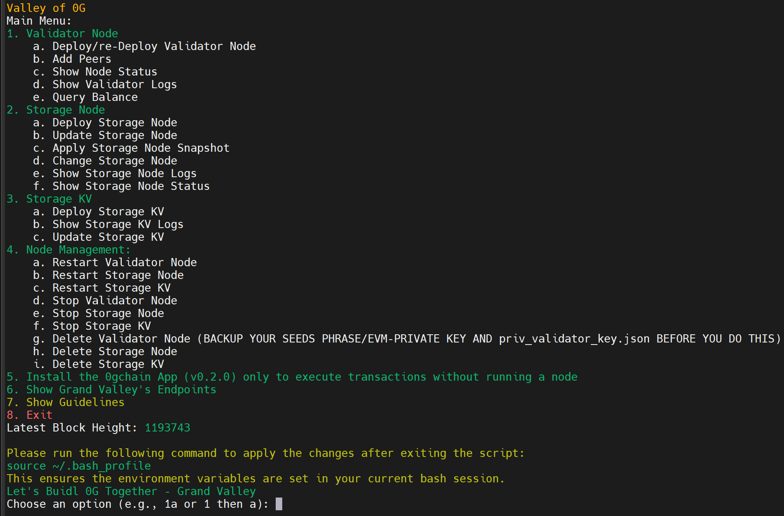
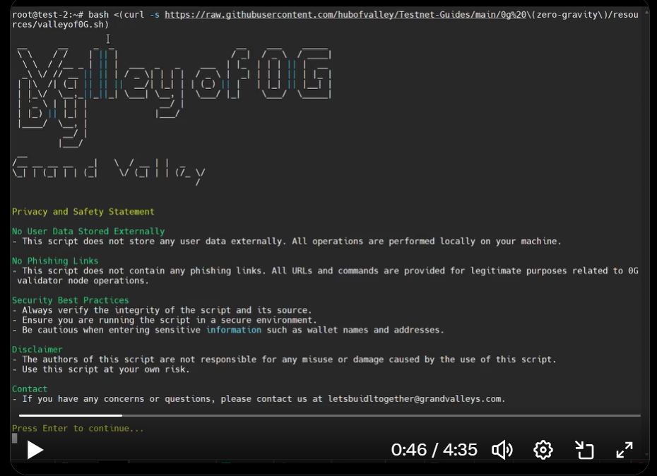

## Valley of 0G: Tools by Grand Valley




**Valley of 0G** by Grand Valley is an all-in-one solution for managing nodes within the 0G decentralized AI network. It provides easy tools to deploy, monitor, and maintain validator and storage nodes, making it simple to manage AI-focused infrastructure. Designed for scalability and performance, Valley of 0G helps efficiently manage data and resources, all within a community-driven environment with public support and endpoints.

### Key Features of Valley of 0G

- **High-Performance Validation:** Deploy powerful validator nodes to secure the 0G network, optimized for transaction consistency and processing speed.
- **Decentralized Data Storage:** Use fast NVMe SSDs for storing 0G network data, ensuring data remains accessible and reliable within a decentralized infrastructure.
- **Specialized Data Handling:** Operate nodes focused on key-value data storage to support real-time access and structured data needs within 0G, ideal for applications requiring rapid data retrieval and streaming.
- **Automated Node Management:** Utilize scripts for efficient deployment, updates, and maintenance, making node management straightforward and minimizing manual effort.
- **Public Endpoints and Support:** Benefit from open endpoints and active social channels that enable developers and users to connect, access resources, and participate in the 0G community.

---

## Installation

#### System Requirements

| Category   | Requirements                  |
| ---------- | ---------------------------- |
| CPU        | 8 cores                      |
| RAM        | 64+ GB                       |
| Storage    | 1+ TB NVMe SSD               |
| Bandwidth  | 100 MBps for Download/Upload |

- Guide's current binaries version: `v0.2.5` (will automatically update to the latest version)
- Service file name: `0gchaind.service`

### Automatic Installation

Run the following command to install Valley of 0G:

```bash
bash <(curl -s https://raw.githubusercontent.com/hubofvalley/Testnet-Guides/main/0g%20\(zero-gravity\)/resources/valleyof0G.sh)
```

### Validator/Full Node Automatic Installation Tutorial Video on X

[](https://x.com/i/status/1920057677453107649)

---

## Manual Installation (Galileo Validator Node)

> **Warning:** This process will remove any previous 0gchaind/0g-geth installation and data on your server.

### 1. Cleanup Previous Installations

```bash
sudo systemctl stop 0gchaind 0g-geth
sudo systemctl disable 0gchaind 0g-geth
sudo rm -rf /etc/systemd/system/0gchaind.service /etc/systemd/system/0g-geth.service
sudo rm -rf $HOME/galileo $HOME/.0gchaind $HOME/.bash_profile
sudo rm /usr/local/bin/0gchaind
```

### 2. Install Dependencies

```bash
sudo apt update -y && sudo apt upgrade -y
sudo apt install -y curl git jq build-essential gcc unzip wget lz4 openssl libssl-dev pkg-config protobuf-compiler clang cmake llvm llvm-dev
```

### 3. Install Go

```bash
cd $HOME && ver="1.22.5"
wget "https://golang.org/dl/go$ver.linux-amd64.tar.gz"
sudo rm -rf /usr/local/go && sudo tar -C /usr/local -xzf "go$ver.linux-amd64.tar.gz"
rm "go$ver.linux-amd64.tar.gz"
echo 'export PATH=$PATH:/usr/local/go/bin:$HOME/go/bin' >> $HOME/.bash_profile
source $HOME/.bash_profile
go version
```

### 4. Download and Extract Galileo Binary

```bash
cd $HOME
wget https://github.com/0glabs/0gchain-ng/releases/download/v1.1.0/galileo-v1.1.0.tar.gz
tar -xzvf galileo-v1.1.0.tar.gz -C $HOME
cd galileo
cp -r 0g-home/* $HOME/galileo/0g-home/
sudo chmod 777 ./bin/geth ./bin/0gchaind
```

### 5. Initialize Node

```bash
# Input your moniker and preferred port (default: 26)
read -p "Enter your moniker: " MONIKER
read -p "Enter your preferred port number (default: 26): " OG_PORT
if [ -z "$OG_PORT" ]; then
    OG_PORT=26
fi

./bin/geth init --datadir $HOME/galileo/0g-home/geth-home ./genesis.json
./bin/0gchaind init "$MONIKER" --home $HOME/galileo/tmp
```

### 6. Patch Configuration Files

```bash
for CONFIG_DIR in "$HOME/galileo/tmp/config" "$HOME/galileo/0g-home/0gchaind-home/config"
do
  sed -i.bak "
  s|tcp://0.0.0.0:26656|tcp://0.0.0.0:${OG_PORT}656|;
  s|tcp://127.0.0.1:26657|tcp://0.0.0.0:${OG_PORT}657|;
  s|tcp://127.0.0.1:26658|tcp://127.0.0.1:${OG_PORT}658|;
  s|0.0.0.0:6060|0.0.0.0:${OG_PORT}060|;
  s|0.0.0.0:26660|0.0.0.0:${OG_PORT}660|
  " "${CONFIG_DIR}/config.toml"

  sed -i.bak "
  s|127.0.0.1:1317|127.0.0.1:${OG_PORT}317|;
  s|127.0.0.1:8545|127.0.0.1:${OG_PORT}545|;
  s|127.0.0.1:8546|127.0.0.1:${OG_PORT}546|;
  s|http://localhost:8551|http://localhost:${OG_PORT}551|;
  s|127.0.0.1:3500|0.0.0.0:${OG_PORT}500|
  " "${CONFIG_DIR}/app.toml"
done

# Patch client.toml and moniker
for CONFIG_DIR in "$HOME/galileo/tmp/config" "$HOME/galileo/0g-home/0gchaind-home/config"
do
  sed -i.bak "s|^node = \".*\"|node = \"tcp://localhost:${OG_PORT}657\"|" "${CONFIG_DIR}/client.toml"
  sed -i.bak "s|^moniker = \".*\"|moniker = \"${MONIKER}\"|" "${CONFIG_DIR}/config.toml"
done

# Add peers to the config.toml
for CONFIG_DIR in "$HOME/galileo/tmp/config" "$HOME/galileo/0g-home/0gchaind-home/config"
do
  peers=$(curl -sS https://lightnode-rpc-0g.grandvalleys.com/net_info | jq -r '.result.peers[] | "\(.node_info.id)@\(.remote_ip):\(.node_info.listen_addr)"' | awk -F ':' '{print $1":"$(NF)}' | paste -sd, -)
  echo $peers
  sed -i -e "s|^persistent_peers *=.*|persistent_peers = \"a97c8615903e795135066842e5739e30d64e2342@peer-0g.grandvalleys.com:28656,$peers\"|" ${CONFIG_DIR}/config.toml
done
```

### 7. Copy Node Keys

```bash
cp $HOME/galileo/tmp/data/priv_validator_state.json $HOME/galileo/0g-home/0gchaind-home/data/
cp $HOME/galileo/tmp/config/node_key.json $HOME/galileo/0g-home/0gchaind-home/config/
cp $HOME/galileo/tmp/config/priv_validator_key.json $HOME/galileo/0g-home/0gchaind-home/config/
```

### 8. Update PATH

```bash
echo 'export PATH=$PATH:$HOME/galileo/bin' >> $HOME/.bash_profile
source $HOME/.bash_profile
```

### 9. Patch geth-config.toml

```bash
GETH_CONFIG="$HOME/galileo/geth-config.toml"
sed -i.bak "
s/^HTTPPort = .*/HTTPPort = ${OG_PORT}545/;
s/^WSPort = .*/WSPort = ${OG_PORT}546/;
s/^AuthPort = .*/AuthPort = ${OG_PORT}551/;
s/^ListenAddr = \":30303\"/ListenAddr = \":${OG_PORT}303\"/
" $GETH_CONFIG
```

### 10. Create systemd Service Files

#### 0gchaind Service

```bash
sudo tee /etc/systemd/system/0gchaind.service > /dev/null <<EOF
[Unit]
Description=0gchaind Node Service
After=network-online.target

[Service]
User=$USER
ExecStart=/bin/bash -c 'cd ~/galileo && CHAIN_SPEC=devnet ./bin/0gchaind start \
    --rpc.laddr tcp://0.0.0.0:${OG_PORT}657 \
    --beacon-kit.kzg.trusted-setup-path=kzg-trusted-setup.json \
    --beacon-kit.engine.jwt-secret-path=jwt-secret.hex \
    --beacon-kit.kzg.implementation=crate-crypto/go-kzg-4844 \
    --beacon-kit.block-store-service.enabled \
    --beacon-kit.node-api.enabled \
    --beacon-kit.node-api.logging \
    --beacon-kit.node-api.address 0.0.0.0:${OG_PORT}500 \
    --pruning=nothing \
    --home $HOME/galileo/0g-home/0gchaind-home \
    --p2p.external_address $(hostname -I | awk '{print $1}'):${OG_PORT}656 \
    --p2p.seeds b30fb241f3c5aee0839c0ea55bd7ca18e5c855c1@8.218.94.246:26656'
Restart=always
RestartSec=3
LimitNOFILE=4096

[Install]
WantedBy=multi-user.target
EOF
```

#### 0g-geth Service

```bash
sudo tee /etc/systemd/system/0g-geth.service > /dev/null <<EOF
[Unit]
Description=0g Geth Node Service
After=network-online.target

[Service]
User=$USER
ExecStart=/bin/bash -c 'cd ~/galileo && ./bin/geth --config geth-config.toml --datadir $HOME/galileo/0g-home/geth-home --networkid 16601'
Restart=always
RestartSec=3
LimitNOFILE=4096

[Install]
WantedBy=multi-user.target
EOF
```

### 11. Start Services

```bash
sudo systemctl daemon-reload
sudo systemctl enable 0g-geth.service
sudo systemctl start 0g-geth.service
sudo systemctl enable 0gchaind.service
sudo systemctl start 0gchaind.service
```

### 12. Check Logs

```bash
sudo journalctl -u 0gchaind -u 0g-geth -fn 100
```

---

## Delete the Node

```bash
sudo systemctl stop 0gchaind
sudo systemctl disable 0gchaind
sudo rm -rf /etc/systemd/system/0gchaind.service
sudo rm -r 0g-chain
sudo rm -rf $HOME/.0gchain
sed -i "/OG_/d" $HOME/.bash_profile
```

---

# Lets Buidl 0G Together