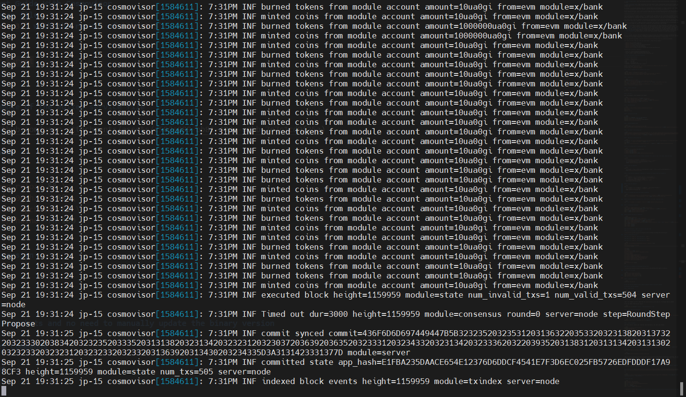

## Valley of 0G: Tools by Grand Valley


**Valley of 0G** by Grand Valley is an all-in-one solution for managing nodes within the 0G decentralized AI network. It provides easy tools to deploy, monitor, and maintain validator and storage nodes, making it simple to manage AI-focused infrastructure. Designed for scalability and performance, Valley of 0G helps efficiently manage data and resources, all within a community-driven environment with public support and endpoints.

### Key Features of Valley of 0G

- **High-Performance Validation:** Deploy powerful validator nodes to secure the 0G network, optimized for transaction consistency and processing speed.
- **Decentralized Data Storage:** Use fast NVMe SSDs for storing 0G network data, ensuring data remains accessible and reliable within a decentralized infrastructure.
- **Specialized Data Handling:** Operate nodes focused on key-value data storage to support real-time access and structured data needs within 0G, ideal for applications requiring rapid data retrieval and streaming.
- **Automated Node Management:** Utilize scripts for efficient deployment, updates, and maintenance, making node management straightforward and minimizing manual effort.
- **Public Endpoints and Support:** Benefit from open endpoints and active social channels that enable developers and users to connect, access resources, and participate in the 0G community.

---
## Installation

#### System Requirements

| Category   | Requirements                  |
| ---------- | ---------------------------- |
| CPU        | 8 cores                      |
| RAM        | 64+ GB                       |
| Storage    | 1+ TB NVMe SSD               |
| Bandwidth  | 100 MBps for Download/Upload |

- Guide's current binaries version: `v0.2.5` (will automatically update to the latest version)
- Service file name: `0gchaind.service`

### Automatic Installation

Run the following command to install Valley of 0G:

```bash
bash <(curl -s https://raw.githubusercontent.com/hubofvalley/Testnet-Guides/main/0g%20(zero-gravity)/resources/valleyof0G.sh)
```

---

### Manual Installation
- Service file name: `0gchaind.service`
- Current chain: `zgtendermint_16600-2`

---

## Manual Installation

### 1. Install Dependencies for Building from Source

```bash
sudo apt update -y && sudo apt upgrade -y && \
sudo apt install -y curl git jq build-essential gcc unzip wget lz4 openssl \
libssl-dev pkg-config protobuf-compiler clang cmake llvm llvm-dev
```

### 2. Install Go

```bash
cd $HOME && ver="1.22.0" && \
wget "https://golang.org/dl/go$ver.linux-amd64.tar.gz" && \
sudo rm -rf /usr/local/go && sudo tar -C /usr/local -xzf "go$ver.linux-amd64.tar.gz" && \
rm "go$ver.linux-amd64.tar.gz" && \
echo 'export PATH=$PATH:/usr/local/go/bin:$HOME/go/bin' >> ~/.bash_profile && \
source ~/.bash_profile && go version
```

### 3. Install Cosmovisor

```bash
go install cosmossdk.io/tools/cosmovisor/cmd/cosmovisor@latest
```

### 4. Set Variables

Enter your moniker, preferred port number, and wallet name:

```bash
read -p "Enter your moniker: " MONIKER && echo "Current moniker: $MONIKER"
read -p "Enter your 2 digits custom port: (leave empty to use default: 26) " OG_PORT && echo "Current port number: ${OG_PORT:-26}"
read -p "Enter your wallet name: " WALLET && echo "Current wallet name: $WALLET"

echo "export WALLET=\"$WALLET\"" >> $HOME/.bash_profile
echo "export MONIKER=\"$MONIKER\"" >> $HOME/.bash_profile
echo "export OG_CHAIN_ID=\"zgtendermint_16600-2\"" >> $HOME/.bash_profile
echo "export OG_PORT=\"${OG_PORT:-26}\"" >> $HOME/.bash_profile
source $HOME/.bash_profile
```

### 5. Download and Build Binary

```bash
git clone -b v0.2.5 https://github.com/0glabs/0g-chain.git
cd 0g-chain
make install
0gchaind version
```

### 6. Configure and Initialize App

```bash
cd $HOME
0gchaind init $MONIKER --chain-id $OG_CHAIN_ID
0gchaind config chain-id $OG_CHAIN_ID
0gchaind config node tcp://localhost:${OG_PORT}657
0gchaind config keyring-backend os
```

### 7. Set Custom Ports in config.toml

```bash
sed -i.bak -e "s%laddr = \"tcp://0.0.0.0:26656\"%laddr = \"tcp://0.0.0.0:${OG_PORT}656\"%;
s%prometheus_listen_addr = \":26660\"%prometheus_listen_addr = \":${OG_PORT}660\"%;
s%proxy_app = \"tcp://127.0.0.1:26658\"%proxy_app = \"tcp://127.0.0.1:${OG_PORT}658\"%;
s%laddr = \"tcp://127.0.0.1:26657\"%laddr = \"tcp://0.0.0.0:${OG_PORT}657\"%;
s%^pprof_laddr = \"localhost:26060\"%pprof_laddr = \"localhost:${OG_PORT}060\"%" $HOME/.0gchain/config/config.toml
```

### 8. Set Custom Ports in app.toml

```bash
sed -i.bak -e "s%address = \"tcp://0.0.0.0:1317\"%address = \"tcp://0.0.0.0:${OG_PORT}317\"%;
s%address = \"127.0.0.1:8545\"%address = \"127.0.0.1:${OG_PORT}545\"%;
s%ws-address = \"127.0.0.1:8546\"%ws-address = \"127.0.0.1:${OG_PORT}546\"%;
s%metrics-address = \"127.0.0.1:6065\"%metrics-address = \"127.0.0.1:${OG_PORT}065\"%" $HOME/.0gchain/config/app.toml
```

### 9. Download genesis.json

```bash
sudo rm $HOME/.0gchain/config/genesis.json && \
wget https://github.com/0glabs/0g-chain/releases/download/v0.2.3/genesis.json -O $HOME/.0gchain/config/genesis.json
```

### 10. Add Seeds to config.toml

```bash
SEEDS="81987895a11f6689ada254c6b57932ab7ed909b6@54.241.167.190:26656,010fb4de28667725a4fef26cdc7f9452cc34b16d@54.176.175.48:26656,e9b4bc203197b62cc7e6a80a64742e752f4210d5@54.193.250.204:26656,68b9145889e7576b652ca68d985826abd46ad660@18.166.164.232:26656,8f21742ea5487da6e0697ba7d7b36961d3599567@og-testnet-seed.itrocket.net:47656" && \
sed -i.bak -e "s/^seeds *=.*/seeds = \"${SEEDS}\"/" $HOME/.0gchain/config/config.toml
```

### 11. Add Peers to config.toml

```bash
peers=$(curl -sS https://lightnode-rpc-0g.grandvalleys.com/net_info | jq -r '.result.peers[] | "\(.node_info.id)@\(.remote_ip):\(.node_info.listen_addr)"' | awk -F ':' '{print $1":"$(NF)}' | paste -sd, -)
echo $peers
sed -i -e "s|^persistent_peers *=.*|persistent_peers = \"$peers\"|" $HOME/.0gchain/config/config.toml
```

### 12. Configure Pruning to Save Storage (Optional)

_If you want to run a full node, skip this step._

```bash
sed -i \
   -e "s/^pruning *=.*/pruning = \"custom\"/" \
   -e "s/^pruning-keep-recent *=.*/pruning-keep-recent = \"100\"/" \
   -e "s/^pruning-interval *=.*/pruning-interval = \"50\"/" \
   "$HOME/.0gchain/config/app.toml"
```

### 13. Open RPC Endpoints

```bash
sed -i \
   -e "s/laddr = \"tcp:\/\/127.0.0.1:${OG_PORT}657\"/laddr = \"tcp:\/\/0.0.0.0:${OG_PORT}657\"/" \
   $HOME/.0gchain/config/config.toml
```

### 14. Open JSON-RPC Endpoints

_Required for running the storage node and storage kv._

```bash
sed -i \
   -e 's/address = "127.0.0.1:${OG_PORT}545"/address = "0.0.0.0:${OG_PORT}545"/' \
   -e 's|^api = ".*"|api = "eth,txpool,personal,net,debug,web3"|' \
   -e 's/logs-cap = 10000/logs-cap = 20000/' \
   -e 's/block-range-cap = 10000/block-range-cap = 20000/' \
   $HOME/.0gchain/config/app.toml
```

### 15. Open API Endpoints

```bash
sed -i \
   -e '/^\[api\]/,/^\[/ s/^enable = .*/enable = true/' \
   $HOME/.0gchain/config/app.toml
```

### 16. Set Minimum Gas Price and Enable Prometheus

```bash
sed -i "s/^minimum-gas-prices *=.*/minimum-gas-prices = \"0ua0gi\"/" $HOME/.0gchain/config/app.toml
sed -i -e "s/prometheus = false/prometheus = true/" $HOME/.0gchain/config/config.toml
```

### 17. Disable Indexer (Optional)

_If you want to run a full node, skip this step._

```bash
sed -i -e "s/^indexer *=.*/indexer = \"null\"/" $HOME/.0gchain/config/config.toml
```

### 18. Initialize Cosmovisor

```bash
echo "export DAEMON_NAME=0gchaind" >> $HOME/.bash_profile
echo "export DAEMON_HOME=$(find $HOME -type d -name ".0gchain" -print -quit)" >> $HOME/.bash_profile
source $HOME/.bash_profile
cosmovisor init $HOME/go/bin/0gchaind
cd $HOME/go/bin/
sudo rm -r $HOME/go/bin/0gchaind
ln -s $HOME/.0gchain/cosmovisor/current/bin/0gchaind 0gchaind
sudo chown -R $USER:$USER $HOME/go/bin/0gchaind
sudo chmod +x $HOME/go/bin/0gchaind
mkdir -p $HOME/.0gchain/cosmovisor/upgrades
mkdir -p $HOME/.0gchain/cosmovisor/backup
```

### 19. Define the Path of Cosmovisor

```bash
input1=$(which cosmovisor)
input2=$(find $HOME -type d -name ".0gchain")
input3=$(find $HOME/.0gchain/cosmovisor -type d -name "backup")
echo "export DAEMON_NAME=0gchaind" >> $HOME/.bash_profile
echo "export DAEMON_HOME=$input2" >> $HOME/.bash_profile
echo "export DAEMON_DATA_BACKUP_DIR=$(find $HOME/.0gchain/cosmovisor -type d -name "backup")" >> $HOME/.bash_profile
source $HOME/.bash_profile
echo "input1. $input1"
echo "input2. $input2"
echo "input3. $input3"
```

#### Save the Results

_They'll be used in the next step._

#### Example Result


---

## Service File Creation

### Create Service File

```bash
sudo tee /etc/systemd/system/0gchaind.service > /dev/null <<EOF
[Unit]
Description=Cosmovisor 0G Node
After=network.target

[Service]
User=$USER
Type=simple
WorkingDirectory=$HOME/.0gchain
ExecStart=$input1 run start --log_output_console
Restart=on-failure
LimitNOFILE=65535
Environment="DAEMON_NAME=0gchaind"
Environment="DAEMON_HOME=$input2"
Environment="DAEMON_ALLOW_DOWNLOAD_BINARIES=true"
Environment="DAEMON_RESTART_AFTER_UPGRADE=true"
Environment="DAEMON_DATA_BACKUP_DIR=$input3"
Environment="UNSAFE_SKIP_BACKUP=true"

[Install]
WantedBy=multi-user.target
EOF
```

---

## Start the Node

```bash
sudo systemctl daemon-reload && \
sudo systemctl enable 0gchaind && \
sudo systemctl restart 0gchaind && \
sudo journalctl -u 0gchaind -fn 100
```

#### Example: Node Running Well



---

## Node Status and Version

### Check Node Version

```bash
cosmovisor run version
```

---

## Validator and Key Commands

### 1. Create Wallet

```bash
0gchaind keys add $WALLET --eth
```


Query the 0x address:

```bash
echo "0x$(0gchaind debug addr $(0gchaind keys show $WALLET -a) | grep hex | awk '{print $3}')"
```

Then, request the test token from the [Faucet](https://faucet.0g.ai/) by entering your 0x address.

Or, you can import your existing wallet:

```bash
0gchaind keys add $WALLET --recover --keyring-backend os --eth
```

### 2. Check Node Synchronization

```bash
0gchaind status | jq .sync_info
```

Make sure your node block height has been synced with the latest block height, or check that the `catching_up` value is `false`.

### 3. Check Your Balance

```bash
0gchaind q bank balances $(0gchaind keys show $WALLET -a)
```

### 4. Create Validator

_Edit your identity, website URL, email, and details as needed. These are optional._

```bash
0gchaind tx staking create-validator \
  --amount=1000000ua0gi \
  --pubkey=$(0gchaind tendermint show-validator) \
  --moniker=$MONIKER \
  --chain-id=$OG_CHAIN_ID \
  --commission-rate=0.10 \
  --commission-max-rate=0.20 \
  --commission-max-change-rate=0.01 \
  --min-self-delegation=1 \
  --from=$WALLET \
  --identity=<your-identity> \
  --website=<your-website-url> \
  --security-contact=<your-mail> \
  --details="let's buidl 0g together" \
  --gas auto \
  --gas-adjustment 1.4 \
  -y
```

`1uaogi = 0.000001AOGI`

### 5. Backup Your Validator 

```bash
nano /$HOME/.0gchain/config/priv_validator_key.json
```

```bash
nano /$HOME/.0gchain/data/priv_validator_state.json
```

Copy all contents of the  and  files and save them in a safe place. This is vital in case you need to migrate your validator node.

### 6. Delegate Token to Validator

#### Self Delegate

```bash
0gchaind tx staking delegate $(0gchaind keys show $WALLET --bech val -a) 1000000ua0gi --from $WALLET --chain-id zgtendermint_16600-2 --gas auto --gas-adjustment 1.4 -y
```

#### Delegate to Grand Valley

[](https://explorer.grandvalleys.com/0g-chain%20testnet/staking/0gvaloper1gela3jtnmen0dmj2q5p0pne5y45ftshzs053x3)

```bash
0gchaind tx staking delegate 0gvaloper1gela3jtnmen0dmj2q5p0pne5y45ftshzs053x3 1000000ua0gi --from $WALLET --chain-id zgtendermint_16600-2 --gas auto --gas-adjustment 1.4 -y
```

---

## Delete the Node

```bash
sudo systemctl stop 0gchaind
sudo systemctl disable 0gchaind
sudo rm -rf /etc/systemd/system/0gchaind.service
sudo rm -r 0g-chain
sudo rm -rf $HOME/.0gchain
sed -i "/OG_/d" $HOME/.bash_profile