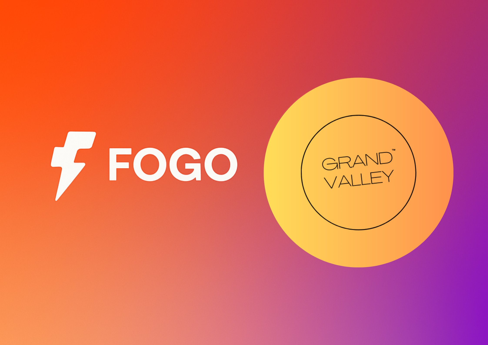

# FogoChain: Reimagining High-Performance Layer 1 Infrastructure for Financial-Grade Applications

  

---

## Executive Summary

FogoChain represents a new frontier in blockchain infrastructure, architected as a high-performance, Solana-compatible Layer 1 protocol. Designed by **Grand Valley**, the project merges raw computational speed with pragmatic decentralization. At its core, Fogo delivers a radically improved execution layer and consensus mechanism, purpose-built for latency-sensitive applications such as high-frequency trading and institutional DeFi.

Engineered with a deep understanding of market infrastructure requirements, FogoChain introduces a novel trinity of innovations:
- A **unified client implementation** based entirely on Firedancer to maximize throughput.
- A **multi-local consensus** mechanism that strategically colocalizes validators to reduce latency.
- A **curated validator set** that prioritizes operational performance and economic integrity.

These components coalesce to offer a scalable, institution-ready blockchain protocol—poised to meet the demands of global finance.

---

## Protocol Design and Architectural Overview

FogoChain builds upon the architectural foundations of Solana while introducing structural enhancements that address key limitations in performance and decentralized coordination. Its defining elements include:

### Firedancer Integration

Fogo utilizes Firedancer, a highly optimized Solana-compatible client developed in C, to enable exceptional transaction processing capabilities. By removing bottlenecks in traditional runtime environments, Firedancer unlocks performance metrics traditionally reserved for centralized systems.

### Multi-Local Consensus

A breakthrough in validator coordination, Fogo's multi-local consensus enables dynamic colocation of validator nodes within physical proximity. This reduces round-trip time for consensus messages, resulting in significantly lower finality latency—essential for real-time financial applications.

### Curated Validator Set

To preserve the protocol's integrity and prevent exploitative behaviors, FogoChain introduces a permissioned validator set in its genesis phase. Over time, governance mechanisms will allow decentralized selection and rotation of validators based on performance metrics and community input.

---

## Strategic Importance and Market Fit

Legacy Layer 1 protocols often face a trilemma: sacrificing either scalability, decentralization, or security. FogoChain challenges this notion with an asymmetric approach—engineering for **financial-grade scalability** without compromising decentralization or fault tolerance.

### Performance Parity with Traditional Finance

FogoChain aims to deliver throughput and latency metrics on par with modern capital markets infrastructure, positioning it as a viable settlement layer for high-speed trading strategies and low-latency market data.

### Decentralization via Design Rotation

Through its rotating colocation zones and validator governance roadmap, Fogo ensures the long-term health of the network remains decentralized while delivering near-centralized speeds in the short term.

### Solana Ecosystem Compatibility

Developers and infrastructure providers benefit from full SVM (Solana Virtual Machine) compatibility—facilitating seamless migration of existing programs, tooling, and integrations from the Solana ecosystem.

---

## Institutional Use Cases

### 1. High-Frequency Trading (HFT)
- Sub-millisecond block finality enables algorithmic and arbitrage strategies with negligible latency overhead.
- Firedancer ensures parallelized execution for sustained transaction surges without congestion.

### 2. Decentralized Financial Markets
- A performant and stable foundation for next-generation DeFi protocols.
- Built to accommodate real-time clearing, order books, and composable lending/derivatives infrastructure.

### 3. Cross-Border Financial Infrastructure
- Network interoperability and low-latency routing support real-time financial messaging and on-chain FX applications.
- Designed for integration with payment networks, custodians, and institutional gateways.

---

## Governance & Validator Management

FogoChain introduces a permissioned validator set in its initial phases to maintain performance guarantees. This set is:
- **Curated for Efficiency:** Validators are selected based on geographic and operational efficiency metrics.
- **Governed for Transition:** A decentralized governance framework will facilitate validator onboarding and rotation, ensuring equitable access and censorship resistance.

Validator key management incorporates a two-tier security model, enabling seamless participation in multi-local consensus while mitigating slashing risk.

---

## Documentation & Resources

- **Website:** [fogo.io](https://www.fogo.io)
- **Whitepaper:** [Protocol Specification (PDF)](https://www.fogo.io/whitepaper.pdf)
- **Blog:** [Insights & Technical Articles](https://www.fogo.io/blog)

---

## Community and Contribution

FogoChain is a decentralized open-source initiative. Grand Valley welcomes researchers, developers, and infrastructure providers to join the effort.

- **Join the Conversation:** [Discord](https://discord.com/invite/FogoChain)
- **Development Repository:** Coming soon
- **Grants Programme:** Funding available for ecosystem projects and protocol research

---

## Contact & Partnerships

- **LinkedIn:** [FogoChain on LinkedIn](https://www.linkedin.com/company/fogochain)
- **X (Twitter):** [@FogoChain](https://x.com/FogoChain)

---

## Closing Statement

FogoChain is not simply a faster blockchain—it is an institutional-grade infrastructure layer reimagined for the digital economy. By combining execution efficiency, secure validator coordination, and seamless compatibility with existing ecosystems, FogoChain charts a new course for performant, decentralized finance.

**Lets Buidl Fogo Together**