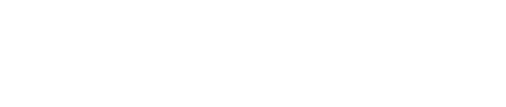

# Optimum Testnet Guide

> _This guide is continuously updated._

  

## Table of Contents

- [Optimum Testnet Guide](#optimum-testnet-guide)
  - [Table of Contents](#table-of-contents)
- [Optimum Overview](#optimum-overview)
  - [What is Optimum?](#what-is-optimum)
  - [Key Innovations](#key-innovations)
  - [Optimum Architecture](#optimum-architecture)
    - [Peer-to-Peer (P2P) Layer](#peer-to-peer-p2p-layer)
    - [DeRAM: The Data Engine](#deram-the-data-engine)
  - [Value Proposition](#value-proposition)
  - [Getting Started on the Testnet](#getting-started-on-the-testnet)
  - [Conclusion](#conclusion)
  - [Official Links](#official-links)
  - [Grand Valley's Optimum Public Endpoints](#grand-valleys-optimum-public-endpoints)
- [Let's Buidl Optimum Together](#lets-buidl-optimum-together)

---

# Optimum Overview

## What is Optimum?

Optimum is a next-generation, modular blockchain network designed to deliver high-performance, decentralized, and censorship-resistant infrastructure for the future of Web3. By combining a robust peer-to-peer (P2P) layer with a powerful data engine called DeRAM, Optimum enables scalable, secure, and permissionless data and value transfer across a global network of nodes.

Optimum is engineered to address the limitations of traditional blockchains—such as scalability bottlenecks, high latency, and centralization risks—by introducing innovative consensus, networking, and data management mechanisms. The result is a blockchain that is not only fast and efficient, but also highly resilient and adaptable to a wide range of use cases, from DeFi and gaming to AI and decentralized storage.

## Key Innovations

- **Random Linear Network Coding (RLNC):** Optimum leverages RLNC to maximize data throughput and resilience, enabling efficient and reliable data propagation across the network. RLNC allows for robust data redundancy and recovery, making the network highly resistant to data loss and censorship.
- **DeRAM (Decentralized RAM):** DeRAM is Optimum’s high-performance, decentralized memory infrastructure. It provides scalable, low-latency storage and retrieval of blockchain data, supporting demanding applications and real-time use cases.
- **Modular Design:** Optimum’s architecture is modular, allowing for seamless upgrades, integration of new protocols, and customization for diverse applications.

## Optimum Architecture

Optimum's architecture is built around two core components: the Peer-to-Peer (P2P) Layer and DeRAM, the data engine. Together, they provide the foundation for a performant, secure, and decentralized network.

### Peer-to-Peer (P2P) Layer

The P2P layer is the backbone of Optimum's decentralized network. It is responsible for:

- **Node Discovery & Connectivity:** Nodes use a robust discovery protocol to find and connect with peers, ensuring a resilient and censorship-resistant topology.
- **Efficient Data Propagation:** Leveraging advanced gossip and relay mechanisms, the P2P layer ensures rapid and reliable propagation of blocks, transactions, and consensus messages.
- **Security & Sybil Resistance:** The network employs cryptographic identities and anti-Sybil mechanisms to prevent malicious actors from disrupting consensus or flooding the network.
- **Modular Networking:** The P2P stack is designed to be modular, allowing for future upgrades and integration with new transport protocols or overlay networks.

### DeRAM: The Data Engine

DeRAM is Optimum's high-performance data engine, designed to handle the storage, retrieval, and validation of blockchain data at scale. Key features include:

- **Optimized Data Structures:** DeRAM uses advanced data structures to enable fast access and verification of blockchain state, supporting high throughput and low latency.
- **Efficient State Management:** By separating consensus and data layers, DeRAM allows for parallel processing and efficient state updates, reducing bottlenecks.
- **Scalable Storage:** The engine supports sharding and data partitioning, enabling the network to scale horizontally as demand grows.
- **Data Availability & Integrity:** DeRAM ensures that all data required for consensus and application logic is available, verifiable, and tamper-proof.

## Value Proposition

Optimum is designed to solve some of the most pressing challenges in blockchain infrastructure:

1. **Scalability:** Modular architecture and efficient data management allow Optimum to support thousands of transactions per second without sacrificing decentralization.
2. **Low Latency:** Advanced networking and parallel processing minimize transaction confirmation times, making Optimum suitable for real-time applications.
3. **Censorship Resistance:** Decentralized P2P topology and Sybil resistance mechanisms ensure that no single entity can control or censor the network.
4. **Flexibility:** The modular design allows developers to customize and extend the network for diverse use cases, from DeFi and NFTs to AI and decentralized storage.
5. **Security:** Strong cryptographic guarantees and robust consensus protocols protect the network from attacks and ensure data integrity.

## Getting Started on the Testnet

To participate in the Optimum testnet:

1. **Visit the Official Documentation:**  
   [Optimum Docs](https://docs.getoptimum.xyz/)
2. **Join the Community:**  
   - [Discord](https://discord.gg/getoptimum)
   - [X (Twitter)](https://x.com/get_optimum)
3. **Set Up a Node:**  
   Follow the step-by-step instructions in the documentation to set up and run an Optimum node.
4. **Explore Public Endpoints:**  
   Use Grand Valley’s public endpoints (listed below) for easy access to the testnet.

## Conclusion

Optimum represents a leap forward in blockchain infrastructure, combining cutting-edge networking, data management, and consensus technologies to deliver a platform that is scalable, secure, and truly decentralized. Whether you're building DeFi protocols, decentralized applications, or next-generation data services, Optimum provides the foundation you need to innovate and scale.

For a deep dive into Optimum's architecture and technology, visit the [Optimum Documentation](https://docs.getoptimum.xyz/).

---

## Official Links

- [Optimum Website](https://www.getoptimum.xyz/)
- [Optimum X (Twitter)](https://x.com/get_optimum)
- [Optimum Discord](https://discord.gg/getoptimum)
- [Optimum Docs](https://docs.getoptimum.xyz/)

## Grand Valley's Optimum Public Endpoints

_Endpoints will be listed here when available._

---

# Let's Buidl Optimum Together