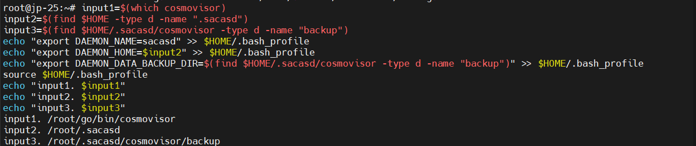

# Sacas Network Testnet Guide by Grand Valley

## Table of Contents

- [Sacas Network Testnet Guide by Grand Valley](#sacas-network-testnet-guide-by-grand-valley)
  - [Table of Contents](#table-of-contents)
- [Sacas Network](#sacas-network)
  - [Key Features](#key-features)
    - [Layer 1 Blockchain](#layer-1-blockchain)
    - [Proof of Stake (PoS) Consensus](#proof-of-stake-pos-consensus)
    - [EVM Compatibility](#evm-compatibility)
    - [Low Gas Fees](#low-gas-fees)
    - [High Transaction Speed](#high-transaction-speed)
    - [ERC-20 \& ERC-721 Support](#erc-20--erc-721-support)
    - [Manual Installation Guide](#manual-installation-guide)
    - [Key Features of Valley of Sacas](#key-features-of-valley-of-sacas)
      - [1. Validator Nodes](#1-validator-nodes)
      - [2. Automation \& Ease of Management](#2-automation--ease-of-management)
      - [3. Community-Focused Accessibility](#3-community-focused-accessibility)
  - [Sacas Validator Node Deployment Guide With Cosmovisor](#sacas-validator-node-deployment-guide-with-cosmovisor)
    - [**System Requirements**](#system-requirements)
  - [Sacas Validator Node Manual Installation](#sacas-validator-node-manual-installation)
    - [1. Install Dependencies for Building from Source](#1-install-dependencies-for-building-from-source)
    - [2. Install Go](#2-install-go)
    - [3. Install Cosmovisor](#3-install-cosmovisor)
    - [4. Set Vars](#4-set-vars)
    - [5. Download Binary](#5-download-binary)
    - [6. Config and Init App](#6-config-and-init-app)
    - [7. Set Chain ID and Custom Ports in client.toml](#7-set-chain-id-and-custom-ports-in-clienttoml)
    - [8. Set Custom Ports in config.toml](#8-set-custom-ports-in-configtoml)
    - [9. Set Custom Ports in app.toml](#9-set-custom-ports-in-apptoml)
    - [10. Add Peers to config.toml](#10-add-peers-to-configtoml)
    - [11. Configure Pruning to Save Storage (Optional)](#11-configure-pruning-to-save-storage-optional)
    - [12. Open RPC Endpoints](#12-open-rpc-endpoints)
    - [13. Open JSON-RPC Endpoints](#13-open-json-rpc-endpoints)
    - [14. Open API Endpoints](#14-open-api-endpoints)
    - [15. Set Minimum Gas Price and Enable Prometheus](#15-set-minimum-gas-price-and-enable-prometheus)
    - [16. Disable Indexer (Optional)](#16-disable-indexer-optional)
    - [17. Initialize Cosmovisor](#17-initialize-cosmovisor)
    - [18. Define the Path of Cosmovisor](#18-define-the-path-of-cosmovisor)
      - [Save the Results](#save-the-results)
      - [Example Result](#example-result)
    - [19. Create Service File](#19-create-service-file)
    - [20. Start the Node](#20-start-the-node)
      - [Example: Node Running Well](#example-node-running-well)
    - [21. Check Node Version](#21-check-node-version)
  - [Snapshots and Node Version](#snapshots-and-node-version)
  - [Validator and Key Commands](#validator-and-key-commands)
    - [1. Create Wallet](#1-create-wallet)
    - [2. Add Genesis Account](#2-add-genesis-account)
    - [3. Generate gentx](#3-generate-gentx)
    - [4. Check Node Synchronization](#4-check-node-synchronization)
    - [5. Check Your Balance](#5-check-your-balance)
    - [6. Create Validator](#6-create-validator)
    - [7. Backup Your Validator ](#7-backup-your-validator-)
    - [8. Delegate Token to Validator](#8-delegate-token-to-validator)
      - [Self Delegate](#self-delegate)
  - [Delete the Node](#delete-the-node)

---

# Sacas Network

Sacas Network is a Layer 1 blockchain built using Cosmos SDK and Tendermint, designed for fast transactions and low gas fees. SACAS is fully EVM-compatible, enabling seamless development of smart contracts and decentralized applications (dApps).

---

## Key Features

### Layer 1 Blockchain

Sacas Network is a robust Layer 1 blockchain designed for high performance and efficiency. It leverages the Cosmos SDK and Tendermint core to provide a secure and scalable infrastructure for decentralized applications.

### Proof of Stake (PoS) Consensus

Sacas Network uses a Proof of Stake (PoS) consensus mechanism, ensuring efficient and secure transaction validation. PoS allows for energy-efficient mining and enhances network security by incentivizing honest participation.

### EVM Compatibility

Sacas Network is fully compatible with the Ethereum Virtual Machine (EVM), enabling seamless deployment and execution of Solidity-based smart contracts. This compatibility allows developers to easily migrate their existing Ethereum-based dApps to Sacas Network, taking advantage of its superior performance and lower costs.

### Low Gas Fees

Benefit from significantly lower gas fees on Sacas Network, making transactions more affordable and accessible. The network's efficient design ensures that users can interact with dApps and execute transactions without incurring high costs.

### High Transaction Speed

Experience near-instant transaction processing on Sacas Network. The network's optimized architecture ensures fast confirmation times, making it ideal for applications requiring high throughput and quick settlement.

### ERC-20 & ERC-721 Support

Sacas Network supports the deployment of ERC-20 and ERC-721 tokens, enabling the creation and management of fungible tokens and non-fungible tokens (NFTs). This feature allows for a wide range of applications, from digital assets to unique collectibles, all seamlessly integrated into the Sacas Network ecosystem.

For more detailed information, visit the [Sacas Network GitHub Repository](https://github.com/sacasnetwork)

---

### Manual Installation Guide

Run the following command to install Valley of Sacas:

```bash
bash <(curl -s https://raw.githubusercontent.com/hubofvalley/Testnet-Guides/main/Sacas%20\(zero-gravity\)/resources/valleyofSacas.sh)
```

---

### Key Features of Valley of Sacas

#### 1. Validator Nodes

- **High-Performance Validation:** Deploy powerful validator nodes to secure the Sacas network, optimized for transaction consistency and processing speed.

#### 2. Automation & Ease of Management

- **Automated Node Management:** Utilize scripts for efficient deployment, updates, and maintenance, making node management straightforward and minimizing manual effort.

#### 3. Community-Focused Accessibility

- **Public Endpoints and Support:** Benefit from open endpoints and active social channels that enable developers and users to connect, access resources, and participate in the Sacas community.

---

## Sacas Validator Node Deployment Guide With Cosmovisor

### **System Requirements**

| Category  | Requirements                   |
| --------- | ------------------------------ |
| CPU       | 8 cores                        |
| RAM       | 8+ GB                          |
| Storage   | 200+ GB NVMe SSD               |
| Bandwidth | 100 MBps for Download / Upload |

- Guide's current binaries version: `v0.20.0`
- Service file name: `sacasd.service`
- Current chain: `sac_1317-1`

---

## Sacas Validator Node Manual Installation

### 1. Install Dependencies for Building from Source

```bash
sudo apt update -y && sudo apt upgrade -y && \
sudo apt install -y curl git jq build-essential gcc unzip wget lz4 openssl \
libssl-dev pkg-config protobuf-compiler clang cmake llvm llvm-dev
```

### 2. Install Go

```bash
cd $HOME && ver="1.22.0" && \
wget "https://golang.org/dl/go$ver.linux-amd64.tar.gz" && \
sudo rm -rf /usr/local/go && sudo tar -C /usr/local -xzf "go$ver.linux-amd64.tar.gz" && \
rm "go$ver.linux-amd64.tar.gz" && \
echo 'export PATH=$PATH:/usr/local/go/bin:$HOME/go/bin' >> ~/.bash_profile && \
source ~/.bash_profile && go version
```

### 3. Install Cosmovisor

```bash
go install cosmossdk.io/tools/cosmovisor/cmd/cosmovisor@latest
```

### 4. Set Vars

Enter your moniker and your preferred port number:

```bash
read -p "Enter your moniker: " MONIKER && echo "Current moniker: $MONIKER"
read -p "Enter your 2 digits custom port: (leave empty to use default: 26) " SACAS_PORT && echo "Current port number: ${SACAS_PORT:-26}"
read -p "Enter your wallet name: " WALLET && echo "Current wallet name: $WALLET"

echo "export WALLET=\"$WALLET\"" >> $HOME/.bash_profile
echo "export MONIKER=\"$MONIKER\"" >> $HOME/.bash_profile
echo "export SACAS_CHAIN_ID=\"sac_1317-1\"" >> $HOME/.bash_profile
echo "export SACAS_PORT=\"${SACAS_PORT:-26}\"" >> $HOME/.bash_profile
source $HOME/.bash_profile
```

### 5. Download Binary

```bash
cd $HOME
git clone -b v0.20.0 https://github.com/sacasnetwork/sacas.git
cd sacas
make install
sacasd version
```

### 6. Config and Init App

```bash
cd $HOME
sacasd init $MONIKER --chain-id $SACAS_CHAIN_ID
```

### 7. Set Chain ID and Custom Ports in client.toml

```bash
sed -i.bak \
  -e "s/^chain-id = \"\"/chain-id = \"$SACAS_CHAIN_ID\"/" \
  -e "s%node = \"tcp://localhost:26657\"%node = \"tcp://localhost:${SACAS_PORT}657\"%" \
  "$HOME/.sacasd/config/client.toml"
```

### 8. Set Custom Ports in config.toml

```bash
sed -i.bak -e "s%laddr = \"tcp://0.0.0.0:26656\"%laddr = \"tcp://0.0.0.0:${SACAS_PORT}656\"%;
s%prometheus_listen_addr = \":26660\"%prometheus_listen_addr = \":${SACAS_PORT}660\"%;
s%proxy_app = \"tcp://127.0.0.1:26658\"%proxy_app = \"tcp://127.0.0.1:${SACAS_PORT}658\"%;
s%laddr = \"tcp://127.0.0.1:26657\"%laddr = \"tcp://0.0.0.0:${SACAS_PORT}657\"%;
s%^pprof_laddr = \"localhost:26060\"%pprof_laddr = \"localhost:${SACAS_PORT}060\"%" $HOME/.sacasd/config/config.toml
```

### 9. Set Custom Ports in app.toml

```bash
sed -i.bak -e "s%address = \"tcp://0.0.0.0:1317\"%address = \"tcp://0.0.0.0:${SACAS_PORT}317\"%;
s%address = \"127.0.0.1:8545\"%address = \"127.0.0.1:${SACAS_PORT}545\"%;
s%ws-address = \"127.0.0.1:8546\"%ws-address = \"127.0.0.1:${SACAS_PORT}546\"%;
s%metrics-address = \"127.0.0.1:6065\"%metrics-address = \"127.0.0.1:${SACAS_PORT}065\"%" $HOME/.sacasd/config/app.toml
```

### 10. Add Peers to config.toml

```bash
peers=$(curl -sS https://lightnode-rpc-sacas.grandvalleys.com/net_info | jq -r '.result.peers[] | "\(.node_info.id)@\(.remote_ip):\(.node_info.listen_addr)"' | awk -F ':' '{print $1":"$(NF)}' | paste -sd, -)
echo $peers
sed -i -e "s|^persistent_peers *=.*|persistent_peers = \"$peers\"|" $HOME/.sacasd/config/config.toml
```

### 11. Configure Pruning to Save Storage (Optional)

```bash
sed -i \
   -e "s/^pruning *=.*/pruning = \"custom\"/" \
   -e "s/^pruning-keep-recent *=.*/pruning-keep-recent = \"100\"/" \
   -e "s/^pruning-interval *=.*/pruning-interval = \"50\"/" \
   "$HOME/.sacasd/config/app.toml"
```

### 12. Open RPC Endpoints

```bash
sed -i \
   -e "s/laddr = \"tcp:\/\/127.0.0.1:${SACAS_PORT}657\"/laddr = \"tcp:\/\/0.0.0.0:${SACAS_PORT}657\"/" \
   $HOME/.sacasd/config/config.toml
```

### 13. Open JSON-RPC Endpoints

```bash
sed -i \
   -e 's/address = "127.0.0.1:${SACAS_PORT}545"/address = "0.0.0.0:${SACAS_PORT}545"/' \
   -e 's|^api = ".*"|api = "eth,txpool,personal,net,debug,web3"|' \
   -e 's/logs-cap = 10000/logs-cap = 20000/' \
   -e 's/block-range-cap = 10000/block-range-cap = 20000/' \
   $HOME/.sacasd/config/app.toml
```

### 14. Open API Endpoints

```bash
sed -i \
   -e '/^\[api\]/,/^\[/ s/^enable = .*/enable = true/' \
   $HOME/.sacasd/config/app.toml
```

### 15. Set Minimum Gas Price and Enable Prometheus

```bash
sed -i "s/^minimum-gas-prices *=.*/minimum-gas-prices = \"0asacas\"/" $HOME/.sacasd/config/app.toml
sed -i -e "s/prometheus = false/prometheus = true/" $HOME/.sacasd/config/config.toml
```

### 16. Disable Indexer (Optional)

```bash
sed -i -e "s/^indexer *=.*/indexer = \"null\"/" $HOME/.sacasd/config/config.toml
```

### 17. Initialize Cosmovisor

```bash
echo "export DAEMON_NAME=sacasd" >> $HOME/.bash_profile
echo "export DAEMON_HOME=$(find $HOME -type d -name ".sacasd" -print -quit)" >> $HOME/.bash_profile
source $HOME/.bash_profile
cosmovisor init $HOME/go/bin/sacasd
cd $HOME/go/bin/
sudo rm -r $HOME/go/bin/sacasd
ln -s $HOME/.sacasd/cosmovisor/current/bin/sacasd sacasd
sudo chown -R $USER:$USER $HOME/go/bin/sacasd
sudo chmod +x $HOME/go/bin/sacasd
mkdir -p $HOME/.sacasd/cosmovisor/upgrades
mkdir -p $HOME/.sacasd/cosmovisor/backup
cd $HOME
```

### 18. Define the Path of Cosmovisor

```bash
input1=$(which cosmovisor)
input2=$(find $HOME -type d -name ".sacasd")
input3=$(find $HOME/.sacasd/cosmovisor -type d -name "backup")
echo "export DAEMON_NAME=sacasd" >> $HOME/.bash_profile
echo "export DAEMON_HOME=$input2" >> $HOME/.bash_profile
echo "export DAEMON_DATA_BACKUP_DIR=$(find $HOME/.sacasd/cosmovisor -type d -name "backup")" >> $HOME/.bash_profile
source $HOME/.bash_profile
echo "input1. $input1"
echo "input2. $input2"
echo "input3. $input3"
```

#### Save the Results

_They'll be used in the next step._

#### Example Result



### 19. Create Service File

```bash
sudo tee /etc/systemd/system/sacasd.service > /dev/null <<EOF
[Unit]
Description=Cosmovisor Sacas Node
After=network.target

[Service]
User=$USER
Type=simple
WorkingDirectory=$HOME/.sacasd
ExecStart=$input1 run start
Restart=on-failure
LimitNOFILE=65535
Environment="DAEMON_NAME=sacasd"
Environment="DAEMON_HOME=$input2"
Environment="DAEMON_ALLOW_DOWNLOAD_BINARIES=true"
Environment="DAEMON_RESTART_AFTER_UPGRADE=true"
Environment="DAEMON_DATA_BACKUP_DIR=$input3"
Environment="UNSAFE_SKIP_BACKUP=true"

[Install]
WantedBy=multi-user.target
EOF
```

### 20. Start the Node

```bash
sudo systemctl daemon-reload && \
sudo systemctl enable sacasd && \
sudo systemctl restart sacasd && \
sudo journalctl -u sacasd -fn 100
```

#### Example: Node Running Well


### 21. Check Node Version

```bash
cosmovisor run version
```

---

## Snapshots and Node Version

You can use any snapshots and do not need to manually update the node version.

---

## Validator and Key Commands

### 1. Create Wallet

```bash
sacasd keys add $WALLET --keyring-backend os
```


Query the 0x address:

```bash
echo "0x$(sacasd debug addr $(sacasd keys show $WALLET -a) | grep hex | awk '{print $3}')"
```

Or you can import your existing wallet:

```bash
sacasd keys add $WALLET --recover --keyring-backend os
```

### 2. Add Genesis Account

```bash
sacasd add-genesis-account $(sacasd keys show $WALLET -a) 1000000000asacas
```

### 3. Generate gentx

```bash
sacasd gentx $WALLET 1000000000asacas --keyring-backend=os --chain-id=$SACAS_CHAIN_ID \
--moniker="$MONIKER$" \
--commission-max-change-rate=0.01 \
--commission-max-rate=1.0 \
--commission-rate=0.07 \
--identity=<your-identity> \
--website=<your-website-url> \
--security-contact=<your-mail> \
--details="let's buidl Sacas together"
```

### 4. Check Node Synchronization

```bash
sacasd status | jq .sync_info
```

Make sure your node block height has been synced with the latest block height, or check that the `catching_up` value is `false`.

### 5. Check Your Balance

```bash
sacasd q bank balances $(sacasd keys show $WALLET -a)
```

### 6. Create Validator

_Edit your identity, website URL, email, and details as needed. These are optional._

```bash
sacasd tx staking create-validator \
  --amount=1000000asacas \
  --pubkey=$(sacasd tendermint show-validator) \
  --moniker=$MONIKER \
  --chain-id=$SACAS_CHAIN_ID \
  --commission-rate=0.10 \
  --commission-max-rate=0.20 \
  --commission-max-change-rate=0.01 \
  --min-self-delegation=1 \
  --from=$WALLET \
  --identity=<your-identity> \
  --website=<your-website-url> \
  --security-contact=<your-mail> \
  --details="let's buidl Sacas together" \
  --gas auto \
  --gas-adjustment 1.4 \
  -y
```

`1asacas = 0.000001SACAS`

### 7. Backup Your Validator 

```bash
nano /$HOME/.sacasd/config/priv_validator_key.json
```

```bash
nano /$HOME/.sacasd/data/priv_validator_state.json
```

Copy all contents of the  and  files and save them in a safe place. This is vital in case you need to migrate your validator node.

### 8. Delegate Token to Validator

#### Self Delegate

```bash
sacasd tx staking delegate $(sacasd keys show $WALLET --bech val -a) 1000000asacas --from $WALLET --chain-id sac_1317-1 --gas auto --gas-adjustment 1.4 -y
```

---

## Delete the Node

```bash
sudo systemctl stop sacasd
sudo systemctl disable sacasd
sudo rm -rf /etc/systemd/system/sacasd.service
sudo rm -r sacas
sudo rm -rf $HOME/.sacasd
sed -i "/OG_/d" $HOME/.bash_profile