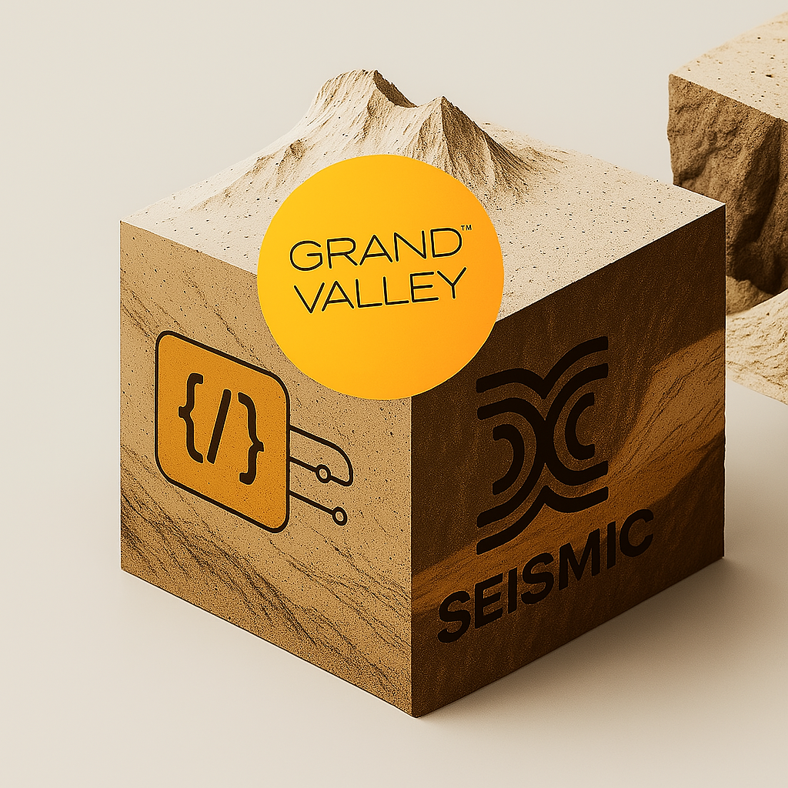

# Seismic: The Encrypted Blockchain  

  

---

## What is Seismic?  

**Seismic** is a blockchain protocol designed to prioritize **privacy-by-default** by integrating encryption natively at every layer of its infrastructure. Unlike conventional blockchains that rely on wallet-level privacy solutions (e.g., zero-knowledge proofs for transactions), Seismic embeds encryption directly into its transactional logic, storage mechanisms, and memory access patterns. This enables developers to build decentralized applications (dApps) where **confidentiality is intrinsic**, ensuring sensitive data remains protected during computation, storage, and communication.  

Seismic’s architecture is built for use cases requiring strict privacy guarantees, such as confidential DeFi, private governance, and secure data-sharing applications. By leveraging secure hardware and protocol-level encryption, it eliminates the trade-off between transparency and privacy, allowing both to coexist.  

---

## Seismic Architecture  

Seismic’s design combines blockchain fundamentals with **Trusted Execution Environments (TEEs)**, specifically Intel’s Trusted Domain Extensions (TDX), to create isolated, encrypted environments for processing sensitive data. Key innovations include:  

- **Encrypted Global State**: A shared encrypted memory layer that enables contracts and users to interact with private data without exposing it. This supports use cases like private order-book trading or confidential DAO voting.  
- **Memory Access Control**: Encrypted pointers and memory zones restrict access to sensitive data, ensuring contract logic (e.g., auctions, financial strategies) remains confidential even during execution.  
- **Flexible Data Flow**: Tools to transition data between public and private states, enabling hybrid models (e.g., public token transfers with private metadata).  

The protocol extends the Ethereum Virtual Machine (EVM) with encrypted storage opcodes (`CLOAD`/`CSTORE`), allowing contracts to operate on encrypted data seamlessly.  

---

## Why Seismic Matters  

Traditional blockchains enforce full transparency, exposing contract logic, user interactions, and business-critical data. This limits adoption in industries requiring confidentiality, such as finance, healthcare, and governance. For example:  
- **DeFi**: Transparent strategies on lending platforms can be front-run or exploited.  
- **DAOs**: Public voting undermines anonymity, leading to coercion risks.  
- **Social Apps**: User activity and reputational metrics are inherently public.  

Seismic addresses these gaps by **decoupling transparency from necessity**. Developers retain control over data exposure, enabling:  
- Private computation (e.g., credit scoring without revealing inputs).  
- Encrypted state transitions (e.g., hidden bid amounts in auctions).  
- Secure inter-contract communication (e.g., shielded cross-chain swaps).  

---

## Use Cases  

### 🔒 Confidential DeFi  
- **Private Lending**: Borrowers prove creditworthiness without exposing balances or collateral details.  
- **Shielded AMMs**: Execute trades with encrypted reserves and pricing logic to prevent MEV.  

### 🗳️ Secure Governance  
- **Anonymous Voting**: DAOs conduct elections with encrypted ballots and verifiable results.  
- **Proposal Privacy**: Teams submit funding proposals without revealing IP pre-execution.  

### 🤐 Encrypted Social Networks  
- **Private Messaging**: On-chain communication with end-to-end encryption.  
- **Reputation Systems**: Track user activity without exposing identities or behavior.  

### 🌐 Enterprise Solutions  
- **Supply Chain**: Share shipment/tracking data between partners confidentially.  
- **Healthcare**: Securely manage patient records and consent on-chain.  

---

## Core Concepts  

### Encrypted Data Types  
- `suint`/`sint`: Encrypted integers for arithmetic operations.  
- `sbool`: Encrypted boolean values for conditional logic.  
- `saddress`: Masked addresses for anonymous interactions.  

### Encrypted Storage  
- **Sealed Memory Zones**: Isolated TEE-backed storage for sensitive data.  
- **Cross-Contract Privacy**: Share encrypted state between contracts without decryption.  

### Development Tools  
- **Seismic SDK**: Typescript library for building encrypted dApps.  
- **Wagmi/Viem Integration**: Plugins for wallet interactions and contract management.  

---

## Resources  
- **[Technical Documentation](https://docs.seismic.systems)**: Protocol specs, API references, and cryptographic design.  
- **[GitHub Repository](https://github.com/SeismicSystems)**: Open-source client, sample contracts, and tooling.  
- **[Developer Portal](https://developer.seismic.com)**: Tutorials, use case guides, and network status.  

---

## Community & Contribution  
Seismic is an open-source project governed by a decentralized community. Contributions are welcome:  
- **Discussions**: Join the [Telegram group](https://t.me/seismicMatt) for technical Q&A.  
- **Code**: Submit pull requests or issues via [GitHub](https://github.com/SeismicSystems).  
- **Grants**: Apply for funding to build privacy-focused dApps on Seismic.  

---

## Contact  
For partnerships or enterprise inquiries:  
- **Email**: [contact@seismic.systems](mailto:contact@seismic.systems)  
- **Twitter**: [@SeismicSystems](https://twitter.com/SeismicSystems)  

---

**Seismic redefines blockchain privacy—not as a feature, but as a foundation.** 