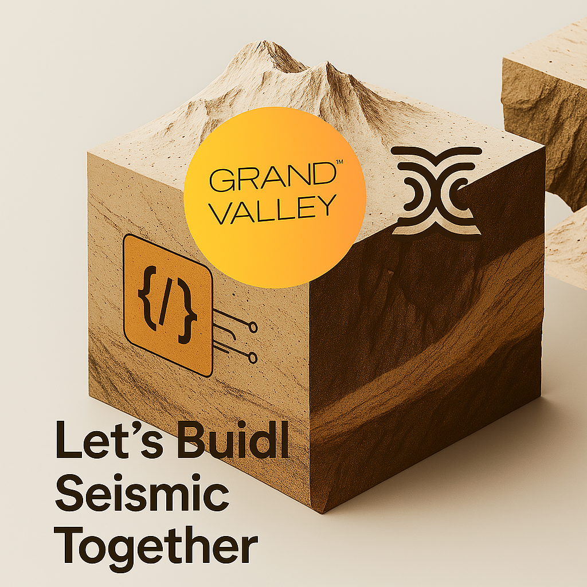

# Seismic: The Encrypted Blockchain

Seismic is a pioneering blockchain platform that integrates robust encryption directly into its protocol, ensuring privacy and security for all users. By embedding encryption at the system's core, Seismic enables developers to create innovative financial applications, investment vehicles, and social experiences that were previously limited by transparency constraints.

## Key Features

- **Encrypted Global State**: Facilitates secure interactions among multiple users, essential for applications like exchanges and lending platforms.
- **Encrypted Memory Access**: Supports encrypted pointers, crucial for functionalities such as auctions and stablecoins.
- **Encrypted Data Flow**: Manages controlled exchanges between encrypted and transparent states, vital for applications ranging from organizational tools to launchpads.

## Getting Started

To begin developing with Seismic, follow these steps:

1. **Installation**: Set up your local development environment by installing necessary tools like `sforge`, `sanvil`, and `ssolc`. Detailed instructions are available in the [Installation Guide](https://docs.seismic.systems/onboarding/publish-your-docs).

2. **Quickstart**: Deploy a sample contract to familiarize yourself with Seismic's capabilities. Refer to the [Quickstart Guide](https://docs.seismic.systems/onboarding/quickstart) for step-by-step instructions.

3. **Tutorial**: Build and deploy the Walnut App, a Seismic-powered shielded contract game. The [Tutorial](https://docs.seismic.systems/onboarding/tutorial) provides comprehensive guidance through the process.

## Core Concepts

Understanding Seismic's foundational elements is crucial for effective development:

- **Data Types**: Learn about `suint`, `sint`, `saddress`, and `sbool` to handle various data operations securely.
- **Collections**: Explore how to manage groups of data efficiently within the Seismic framework.
- **Clients**: Understand the client structures to interact seamlessly with the Seismic network.

For an in-depth exploration, refer to the [Core Concepts](https://docs.seismic.systems/core/basics) section in the documentation.

## Developer Resources

Seismic offers a suite of resources to support developers:

- **Developer Documentation**: Access comprehensive guides and API references at the [Seismic Book](https://docs.seismic.systems/).
- **GitHub Repositories**: Explore our codebase and contribute to ongoing projects at [Seismic GitHub](https://github.com/SeismicSystems).
- **Developer Portal**: Engage with APIs, app capabilities, and integration guides at the [Seismic Developer Portal](https://developer.seismic.com/).

## Community and Support

Join our vibrant community to connect with other developers and stay updated:

- **Telegram**: Engage in discussions and get support from the Seismic team and community members.
- **Discord**: Participate in real-time conversations and collaborate on projects.
- **Twitter**: Follow us for the latest updates and announcements.

## Contributing

We welcome contributions to Seismic! To get involved:

- **GitHub**: Explore our codebase and contribute to the development of Seismic on [GitHub](https://github.com/SeismicSystems).
- **Developer Group**: Join our invite-only developer Telegram group by reaching out to [@seismicMatt](https://t.me/seismicMatt) for access.

## Contact

For inquiries or more information:

- **Email**: [L@seismic.systems](mailto:L@seismic.systems).

Explore more about Seismic and start building on the encrypted blockchain today!