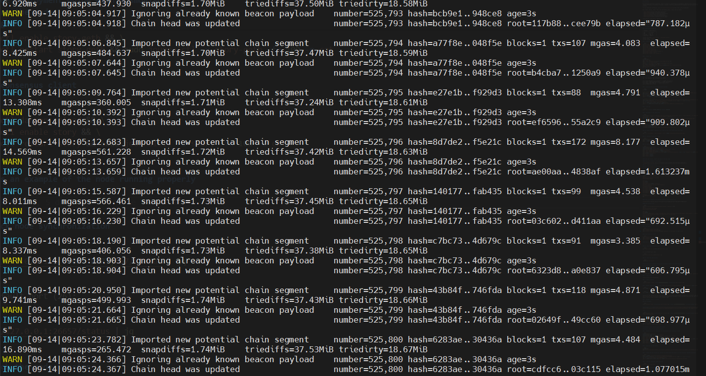
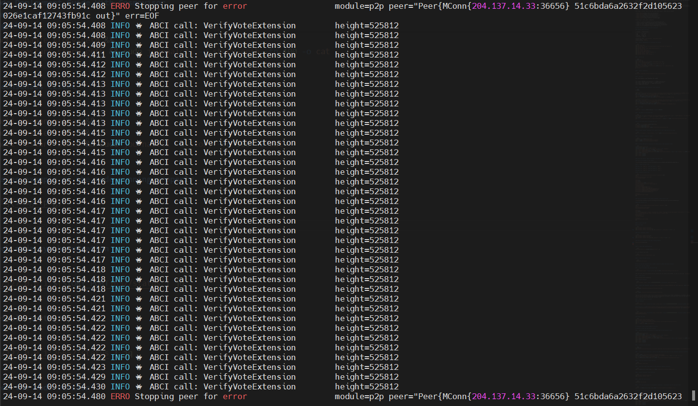

# Story Protocol Testnet Guide

`will always update`

<p align="center">
  
</p>

- [Story Protocol Testnet Guide](#story-protocol-testnet-guide)
- [Story Protocol](#story-protocol)
  - [What Is Story?](#what-is-story)
  - [Story’s Architecture](#storys-architecture)
    - [Components](#components)
    - [Modules](#modules)
  - [Programmable IP License (PIL)](#programmable-ip-license-pil)
  - [Story Solving Target](#story-solving-target)
  - [Example Use Case](#example-use-case)
  - [Conclusion](#conclusion)
  - [Grand Valley's Story Protocol public endpoints:](#grand-valleys-story-protocol-public-endpoints)
  - [Valley Of Story. Story Protocol tools created by Grand Valley](#valley-of-story-story-protocol-tools-created-by-grand-valley)
    - [Key Features of Valley Of Story](#key-features-of-valley-of-story)
  - [Story Node Deployment Guide With Cosmovisor](#story-node-deployment-guide-with-cosmovisor)
    - [**System Requirements**](#system-requirements)
  - [Validator Manual installation](#validator-manual-installation)
    - [1. install dependencies for building from source](#1-install-dependencies-for-building-from-source)
    - [2. install go](#2-install-go)
    - [3. install cosmovisor](#3-install-cosmovisor)
    - [4. set vars](#4-set-vars)
    - [5. download geth and consensus client binaries](#5-download-geth-and-consensus-client-binaries)
    - [6. init app](#6-init-app)
    - [7. set custom ports in config.toml file](#7-set-custom-ports-in-configtoml-file)
    - [8. add peers to the config.toml](#8-add-peers-to-the-configtoml)
    - [9. enable indexer (optional) (if u want to run a full node follow this step)](#9-enable-indexer-optional-if-u-want-to-run-a-full-node-follow-this-step)
    - [10. init cosmovisor](#10-init-cosmovisor)
    - [11. define the path of cosmovisor for being used in the consensus client](#11-define-the-path-of-cosmovisor-for-being-used-in-the-consensus-client)
      - [save the results, they'll be used in the next step](#save-the-results-theyll-be-used-in-the-next-step)
      - [this is an example of the result](#this-is-an-example-of-the-result)
    - [12. create service files](#12-create-service-files)
        - [consensus client service file](#consensus-client-service-file)
        - [geth service file](#geth-service-file)
    - [13. start the node](#13-start-the-node)
      - [start geth \& consensus client](#start-geth--consensus-client)
      - [this is an example of the node running properly](#this-is-an-example-of-the-node-running-properly)
        - [story-geth logs](#story-geth-logs)
        - [story logs](#story-logs)
    - [14. check node synchronization](#14-check-node-synchronization)
    - [15. check the node version](#15-check-the-node-version)
  - [Validator and key Commands](#validator-and-key-commands)
    - [1. export evm public key and private key](#1-export-evm-public-key-and-private-key)
    - [2. claim faucet](#2-claim-faucet)
    - [3. create validator](#3-create-validator)
    - [4. BACKUP YOUR VALIDATOR ](#4-backup-your-validator-)
    - [5. delegate token to validator](#5-delegate-token-to-validator)
      - [self delegate](#self-delegate)
      - [delegate to ](#delegate-to-)
  - [delete the node](#delete-the-node)
  - [upgrade consensus client version to `v0.12.1` at height `322000`](#upgrade-consensus-client-version-to-v0121-at-height-322000)
- [let's buidl together](#lets-buidl-together)

# Story Protocol

## What Is Story?

Story is an innovative initiative designed to revolutionize the management of creative Intellectual Property (IP) by leveraging blockchain technology. By making IP "programmable," Story aims to streamline the processes of protection, licensing, and monetization of creative works. The core of this endeavor is the Story Network, a specialized layer 1 blockchain built to support efficient and scalable IP management.


In the sections below, we will delve deeper into this architecture and explore the key use cases it unlocks.

## Story’s Architecture

Story Network is a purpose-built layer 1 blockchain that combines the advantages of EVM (Ethereum Virtual Machine) and Cosmos SDK. It is fully EVM-compatible and features deep execution layer optimizations to support complex data structures like IP quickly and cost-efficiently. Key features include:

1. **Precompiled Primitives**: These allow the system to traverse complex data structures like IP graphs within seconds at marginal costs, ensuring that the licensing process is both fast and affordable.

2. **Consensus Layer**: Based on the mature CometBFT stack, this layer ensures fast finality and cheap transactions, further enhancing the efficiency of the network.

The Proof-of-Creativity Protocol is a set of smart contracts natively deployed on Story Network. It allows creators to register their IP as "IP Assets" (IPA) on the protocol.

### Components

- **On-Chain NFT**: Represents the IP, which could be an existing NFT or a new NFT minted to represent off-chain IP.
- **IP Account**: A modified ERC-6551 (Token Bound Account) implementation that manages the IP.

### Modules

- **Licensing Module**: Allows creators to set terms on their IP, such as whether derivative works can use the IP commercially.
- **Royalty Module**: Enables the creation of revenue streams from derivative works.
- **Dispute Module**: Facilitates the resolution of disputes.

## Programmable IP License (PIL)

The PIL is an off-chain legal contract that enforces the terms of IP Assets and License Tokens. It allows the redemption of tokenized IP into the off-chain legal system, outlining real legal terms for how creators can remix, monetize, and create derivatives of their IP.

## Story Solving Target

The increasing need for greater efficiency in IP management has coincided with the rise of blockchain technology, which is essential for addressing the current system's challenges. Traditional methods of protecting and licensing IP are cumbersome and expensive, often requiring the involvement of lawyers. This makes the process inaccessible for many creators, particularly those without substantial resources.

Moreover, the current system relies on one-to-one licensing deals, which are not scalable. This leads to many potential licensing opportunities being missed, stifling creativity and innovation. Additionally, the rapid proliferation of AI-generated media has outpaced the current IP system, which was designed for physical replication. There is an urgent need to automate and optimize the licensing of IP to keep up with the digital age.

Story offers a solution with a specialized layer 1 blockchain that combines the advantages of EVM and Cosmos SDK, providing the infrastructure needed for massive IP data scalability. Key applications of Story include:

1. **Creators**: Story enables creators to register their IP as IP Assets and set terms using the Programmable IP License (PIL).
2. **Derivative Works**: Creators of derivative works can license IP automatically through the blockchain, making the process efficient and scalable.
3. **AI-Generated Media**: Story supports the efficient management of AI-generated content by automating the licensing process.
4. **Scalable Licensing**: Story's approach to licensing ensures that all potential opportunities are captured, fostering creativity and collaboration.

## Example Use Case

Without Story, creating a comic with multiple IPs (e.g., Azuki and Pudgy NFTs) would require extensive legal work, making it impractical. With Story, IP holders can register their IP, set terms, and license their work automatically through the blockchain, making the process efficient and scalable.

## Conclusion

By leveraging blockchain technology, Story is poised to revolutionize IP management, making it more efficient, scalable, and accessible for creators worldwide. It provides a scalable, low-cost, and fully programmable IP management solution essential for bringing vast amounts of IP on-chain.

For more detailed information, visit the [Story Documentation](https://docs.story.foundation).

With Public Testnet, Story's docs and code become public. Check them out below!

- [Story Website](https://www.story.foundation/)
- [Story Twitter](https://x.com/StoryProtocol)
- [Story Discord](https://discord.gg/storyprotocol)
- [Story Docs](https://docs.story.foundation/)
- [Story GitHub](https://github.com/storyprotocol)
- [Story Explorer](https://testnet.storyscan.app/)
- [Piplabs Github](https://github.com/piplabs)

## Grand Valley's Story Protocol public endpoints:

- cosmos rpc: `https://lightnode-rpc-story.grandvalleys.com`
- json-rpc: `https://lightnode-json-rpc-story.grandvalleys.com`
- cosmos rest-api: `https://lightnode-api-story.grandvalleys.com`
- cosmos ws: `wss://lightnode-rpc-story.grandvalleys.com/websocket`
- evm ws: `wss://lightnode-wss-story.grandvalleys.com`

## Valley Of Story. Story Protocol tools created by Grand Valley


```bash
bash <(curl -s https://raw.githubusercontent.com/hubofvalley/Testnet-Guides/main/Story%20Protocol/resources/valleyofStory.sh)
```

### Key Features of Valley Of Story

1. **Node Interactions**:

   - **Deploy and Manage Validator Nodes**: Easily deploy a new validator node or remove an existing one. Important! Make sure to back up critical files (seed phrases, private keys, `priv_validator_key.json`) before deletion.
   - **Node Control**: Start, stop, or restart the validator node as needed.
   - **Node Status**: View the current operational status of the validator node.
   - **Peer Management**: Add peers to ensure efficient communication and stability within the network.
   - **Client Updates**: Update both the Consensus Client and Geth (Execution Client) versions to maintain node compatibility and performance.
   - **Targeted Controls**: Stop or restart only specific services, such as the Consensus Client or Geth, for fine-tuned management.
   - **Logging**: Access combined logs for both Consensus Client and Geth, streamlining troubleshooting and monitoring.

2. **Validator and Key Interactions**:

   - **Validator Setup**: Create a validator to participate in consensus and network security.
   - **Key Management**: Export EVM private keys and back up the validator key to prevent any potential data loss.
   - **Stake and Unstake Tokens**: Stake tokens to secure the network or unstake them as needed, along with querying the validator's public key and account balance.

3. **Snapshot Application**:

   - Apply the latest snapshot to speed up the node setup process, allowing quick synchronization with the network.

4. **Story App Installation**:
   - Install the Story app without running the node, enabling users to execute transactions or interact with the network directly from the command line (version v0.12.1).

Valley Of Story is designed to provide node runners in the Story Protocol ecosystem with an accessible, powerful set of tools for node management and validator interaction, all within a single, streamlined interface.

**Valley of Story** by Grand Valley is a robust infrastructure solution supporting Story Protocol, a decentralized network aimed at scalable, reliable data and transaction processing.

## Story Node Deployment Guide With Cosmovisor

### **System Requirements**

| Category  | Requirements     |
| --------- | ---------------- |
| CPU       | 8+ cores         |
| RAM       | 32+ GB           |
| Storage   | 500+ GB NVMe SSD |
| Bandwidth | 10MBit/s         |

- service file name: `story.service` `story-geth.service`
- current chain: `odyssey`
- current story node version: `v0.12.0`
- current story-geth node version: `v0.10.0`

## Validator Manual installation

### 1. install dependencies for building from source

```bash
sudo apt update -y && sudo apt upgrade -y && \
sudo apt install -y curl git jq build-essential gcc unzip wget lz4 openssl \
libssl-dev pkg-config protobuf-compiler clang cmake llvm llvm-dev
```

### 2. install go

```bash
cd $HOME && ver="1.22.0" && \
wget "https://golang.org/dl/go$ver.linux-amd64.tar.gz" && \
sudo rm -rf /usr/local/go && sudo tar -C /usr/local -xzf "go$ver.linux-amd64.tar.gz" && \
rm "go$ver.linux-amd64.tar.gz" && \
echo 'export PATH=$PATH:/usr/local/go/bin:$HOME/go/bin' >> ~/.bash_profile && \
source ~/.bash_profile && go version
```

### 3. install cosmovisor

```bash
go install cosmossdk.io/tools/cosmovisor/cmd/cosmovisor@latest
```

### 4. set vars

EDIT YOUR MONIKER & YOUR PREFERRED PORT NUMBER

```bash
read -p "Enter your moniker: " MONIKER && echo "Current moniker: $MONIKER"
read -p "Enter your 2 digits custom port: (leave empty to use default: 26)" STORY_PORT && echo "Current port number: ${STORY_PORT:-26}"

echo "export MONIKER="$MONIKER"" >> $HOME/.bash_profile
echo "export STORY_CHAIN_ID="odyssey"" >> $HOME/.bash_profile
echo "export STORY_PORT="$STORY_PORT"" >> $HOME/.bash_profile
source $HOME/.bash_profile
```

### 5. download geth and consensus client binaries

```bash
cd $HOME

# geth binary
mkdir -p story-geth-v0.10.0
wget -O story-geth-v0.10.0/geth-linux-amd64 https://github.com/piplabs/story-geth/releases/download/v0.10.0/geth-linux-amd64
story_file__name=geth-linux-amd64
cp story-geth-v0.10.0/$story_file__name $HOME/go/bin/geth
sudo chown -R $USER:$USER $HOME/go/bin/geth
sudo chmod +x $HOME/go/bin/geth

# consensus client binary
mkdir -p story-v0.12.0
wget -O story-v0.12.0/story-linux-amd64 https://github.com/piplabs/story/releases/download/v0.12.0/story-linux-amd64
story_file__name=story-linux-amd64
cp story-v0.12.0/$story_file__name $HOME/go/bin/story
sudo chown -R $USER:$USER $HOME/go/bin/story
sudo chmod +x $HOME/go/bin/story
```

### 6. init app

```bash
story init --network $STORY_CHAIN_ID --moniker $MONIKER
```

### 7. set custom ports in config.toml file

```bash
sed -i.bak -e "/^\[p2p\]/,/^$/ s%laddr = \"tcp://0.0.0.0:26656\"%laddr = \"tcp://0.0.0.0:${STORY_PORT}656\"%g;
s%prometheus_listen_addr = \":26660\"%prometheus_listen_addr = \":${STORY_PORT}660\"%g;
s%proxy_app = \"tcp://127.0.0.1:26658\"%proxy_app = \"tcp://127.0.0.1:${STORY_PORT}658\"%g;
s%^laddr = \"tcp://127.0.0.1:26657\"%laddr = \"tcp://0.0.0.0:${STORY_PORT}657\"%g" $HOME/.story/story/config/config.toml
```

### 8. add peers to the config.toml

```bash
peers=$(curl -sS https://lightnode-rpc-story.grandvalleys.com/net_info | jq -r '.result.peers[] | "\(.node_info.id)@\(.remote_ip):\(.node_info.listen_addr)"' | awk -F ':' '{print $1":"$(NF)}' | paste -sd, -)
sed -i -e "s|^persistent_peers *=.*|persistent_peers = \"$peers\"|" $HOME/.story/story/config/config.toml
echo $peers
```

### 9. enable indexer (optional) (if u want to run a full node follow this step)

```bash
sed -i -e 's/^indexer = "null"/indexer = "kv"/' $HOME/.story/story/config/config.toml
```

### 10. init cosmovisor

```bash
echo "export DAEMON_NAME=story" >> $HOME/.bash_profile
echo "export DAEMON_HOME=$(find $HOME -type d -name "story")" >> $HOME/.bash_profile
source $HOME/.bash_profile
cosmovisor init $HOME/go/bin/story && \
mkdir -p $HOME/.story/story/cosmovisor/upgrades && \
mkdir -p $HOME/.story/story/cosmovisor/backup
```

### 11. define the path of cosmovisor for being used in the consensus client

```bash
input1=$(which cosmovisor)
input2=$(find $HOME -type d -name "story")
input3=$(find $HOME/.story/story/cosmovisor -type d -name "backup")
echo "export DAEMON_NAME=story" >> $HOME/.bash_profile
echo "export DAEMON_HOME=$input2" >> $HOME/.bash_profile
echo "export DAEMON_DATA_BACKUP_DIR=$(find $HOME/.story/story/cosmovisor -type d -name "backup")" >> $HOME/.bash_profile
source $HOME/.bash_profile
echo "input1. $input1"
echo "input2. $input2"
echo "input3. $input3"
```

#### save the results, they'll be used in the next step

#### this is an example of the result


### 12. create service files

##### consensus client service file

```bash
sudo tee /etc/systemd/system/story.service > /dev/null <<EOF
[Unit]
Description=Cosmovisor Story Node
After=network.target

[Service]
User=$USER
Type=simple
WorkingDirectory=$HOME/.story/story
ExecStart=$input1 run run
Restart=on-failure
RestartSec=5
LimitNOFILE=65536
LimitNPROC=65536
Environment="DAEMON_NAME=story"
Environment="DAEMON_HOME=$input2"
Environment="DAEMON_ALLOW_DOWNLOAD_BINARIES=true"
Environment="DAEMON_RESTART_AFTER_UPGRADE=true"
Environment="DAEMON_DATA_BACKUP_DIR=$input3"
Environment="UNSAFE_SKIP_BACKUP=true"

[Install]
WantedBy=multi-user.target
EOF
```

##### geth service file

```bash
sudo tee /etc/systemd/system/story-geth.service > /dev/null <<EOF
[Unit]
Description=Story Geth Node
After=network-online.target

[Service]
User=$USER
ExecStart=$(which geth) --odyssey --syncmode full --http --http.api eth,net,web3,engine --http.vhosts '*' --http.addr 0.0.0.0 --http.port 8545 --ws --ws.api eth,web3,net,txpool --ws.addr 0.0.0.0 --ws.port 8546
Restart=on-failure
RestartSec=3
LimitNOFILE=65536
LimitNPROC=65536

[Install]
WantedBy=multi-user.target
EOF
```

### 13. start the node

#### start geth & consensus client

```bash
sudo systemctl daemon-reload && \
sudo systemctl enable story-geth story && \
sudo systemctl restart story-geth story && \
sudo journalctl -u story-geth -u story -fn 100
```

#### this is an example of the node running properly

##### story-geth logs



##### story logs



### 14. check node synchronization

```bash
curl http://127.0.0.1:${STORY_PORT}657/status | jq
```

if u use default port (26):

```bash
curl http://127.0.0.1:26657/status | jq
```

### 15. check the node version

```bash
cosmovisor run version
```

## Validator and key Commands

### 1. export evm public key and private key

```bash
story validator export --export-evm-key && cat $HOME/.story/story/config/private_key.txt
```

make sure your node block height has been synced with the latest block height. or you can check the `catching_up` value must be `false`

### 2. claim faucet

https://faucet.story.foundation/

### 3. create validator

```bash
 story validator create --stake 1000000000000000000 --private-key <your private key>
```

### 4. BACKUP YOUR VALIDATOR 

```bash
nano /$HOME/.story/story/config/priv_validator_key.json
```

```bash
nano /$HOME/.story/story/data/priv_validator_state.json
```

copy all of the contents of the  !and  files and save them in a safe place. This is a vital step in case you need to migrate your validator node

### 5. delegate token to validator

#### self delegate

```bash
story validator stake --private-key <your private key> --stake 1024000000000000000000 --validator-pubkey <your validator public key>
```

#### delegate to <a href="https://testnet.storyscan.app/validators/storyvaloper1cvsdp0tsz25fhedd7cjvntq42347astvar06v8">

</a>

```bash
story validator stake --private-key <your private key> --stake 1024000000000000000000 --validator-pubkey 036a75cfa84cf485e5b4a6844fa9f2ff03f410f7c8c0148f4e4c9e535df9caba22/wP0EPfIwBSPTkyeU135yroi
```

## delete the node

```bash
sudo systemctl stop story-geth story
sudo systemctl disable story-geth story
sudo rm -rf /etc/systemd/system/story-geth.service /etc/systemd/system/story.service
sudo rm -r .story
sed -i "/STORY_/d" $HOME/.bash_profile
```

## upgrade consensus client version to `v0.12.1` at height `322000`

```bash
# Define variables
input1=$(which cosmovisor)
input2=$(find $HOME -type d -name "story")
input3=$(find $HOME/.story/story/cosmovisor -type d -name "backup")
story_file_name=story-linux-amd64

# Export environment variables
echo "export DAEMON_NAME=story" >> $HOME/.bash_profile
echo "export DAEMON_HOME=$input2" >> $HOME/.bash_profile
echo "export DAEMON_DATA_BACKUP_DIR=$input3" >> $HOME/.bash_profile
source $HOME/.bash_profile

# Create directory and download the binary
mkdir -p $HOME/v0.12.1
cd $HOME/v0.12.1 && \
wget https://github.com/piplabs/story/releases/download/v0.12.1/$story_file_name

# Move the binary to the appropriate directory
sudo cp $HOME/v0.12.1/$story_file_name $HOME/go/bin/story

# Set ownership and permissions
sudo chown -R $USER:$USER $HOME/.story && \
sudo chown -R $USER:$USER $HOME/go/bin/story && \
sudo rm $HOME/.story/story/data/upgrade-info.json

# Add the upgrade to cosmovisor
cosmovisor add-upgrade v0.12.1 $HOME/v0.12.1/$story_file_name --upgrade-height 322000 --force
```

# let's buidl together
