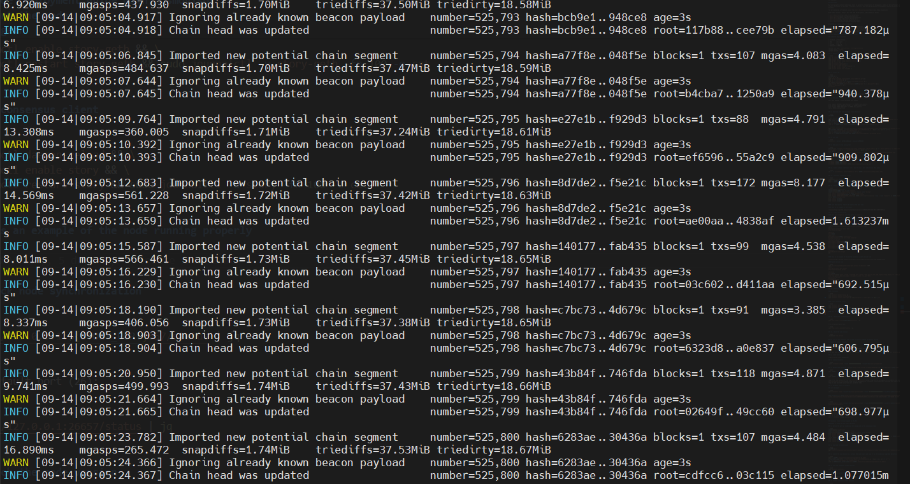
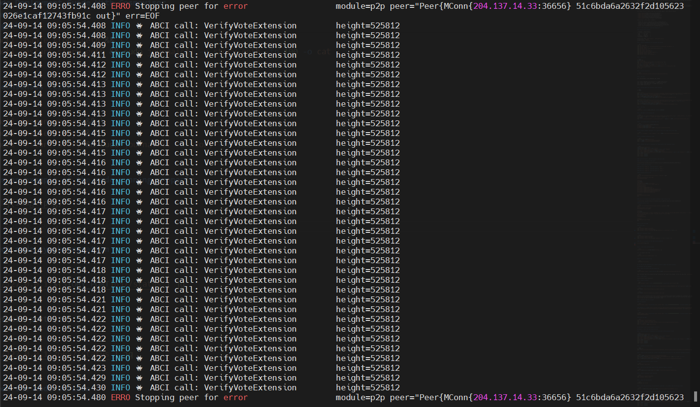

## Valley of Story (Testnet): Tools by Grand Valley


**Valley of Story** by Grand Valley is an all-in-one infrastructure solution providing powerful tools for efficient node management and validator interactions within the Story Protocol network. Designed for node runners in the Story Protocol ecosystem, Valley of Story offers an accessible, streamlined interface to manage nodes, maintain network participation, and perform validator functions effectively.

### Key Features of Valley of Story

- **Deploy and Manage Validator Nodes:** Deploy new validator nodes or remove existing ones. **Important!** Always back up critical files (e.g., seed phrases, private keys, `priv_validator_key.json`) before deletion.
- **Node Control:** Start, stop, or restart validator nodes as needed.
- **Node Status:** Monitor the current operational status of the validator node.
- **Peer Management:** Add peers to enhance network stability and communication.
- **Client Updates:** Update Consensus Client and Geth (Execution Client) to ensure compatibility and performance.
- **Targeted Controls:** Stop or restart specific services, such as the Consensus Client or Geth, for more granular control.
- **Logging:** Access unified logs for both Consensus Client and Geth, aiding in troubleshooting and monitoring.
- **Validator Setup:** Create a validator to engage in network consensus and security.
- **Key Management:** Export EVM private keys and back up validator keys to prevent data loss.
- **Stake and Unstake Tokens:** Stake tokens to support network security or unstake them as required. Also, query validator public keys and account balances.
- **Snapshot Application:** Quickly synchronize with the network by applying the latest snapshot, expediting node setup.
- **Story App Installation:** Install the Story app for command-line transactions and network interactions without running a full node.

## Installation

#### System Requirements

| Category   | Requirements     |
| ---------- | ---------------- |
| CPU        | 8+ cores         |
| RAM        | 32+ GB           |
| Storage    | 500+ GB NVMe SSD |
| Bandwidth  | 10MBit/s         |

- Service file names: `story.service`, `story-geth.service`
- Current chain: `aeneid`
- Current story node version: `v1.1.0 - v1.1.1`
- Current story-geth node version: `v1.0.2`

### Automatic Installation

Run the following command to install Valley of Story:

```bash
bash <(curl -s https://raw.githubusercontent.com/hubofvalley/Testnet-Guides/main/Story%20Protocol/resources/valleyofStory.sh)
```

- Install the Story app for command-line transactions and network interactions without running a full node.

---


### Manual Installation


---


### 1. Install Dependencies for Building from Source

```bash
sudo apt update -y && sudo apt upgrade -y && \
sudo apt install -y curl git jq build-essential gcc unzip wget lz4 openssl \
libssl-dev pkg-config protobuf-compiler clang cmake llvm llvm-dev
```

### 2. Install Go

```bash
cd $HOME && ver="1.22.0" && \
wget "https://golang.org/dl/go$ver.linux-amd64.tar.gz" && \
sudo rm -rf /usr/local/go && sudo tar -C /usr/local -xzf "go$ver.linux-amd64.tar.gz" && \
rm "go$ver.linux-amd64.tar.gz" && \
echo 'export PATH=$PATH:/usr/local/go/bin:$HOME/go/bin' >> ~/.bash_profile && \
source ~/.bash_profile && go version
```

### 3. Install Cosmovisor

```bash
go install cosmossdk.io/tools/cosmovisor/cmd/cosmovisor@latest
```

### 4. Set Vars

Edit your moniker and your preferred port number:

```bash
read -p "Enter your moniker: " MONIKER && echo "Current moniker: $MONIKER"
read -p "Enter your 2 digits custom port: (leave empty to use default: 26)" STORY_PORT && echo "Current port number: ${STORY_PORT:-26}"

echo "export MONIKER=$MONIKER" >> $HOME/.bash_profile
echo "export STORY_CHAIN_ID=aeneid" >> $HOME/.bash_profile
echo "export STORY_PORT=$STORY_PORT" >> $HOME/.bash_profile
source $HOME/.bash_profile
```

### 5. Download Geth and Consensus Client Binaries

```bash
cd $HOME

# geth binary
mkdir -p story-geth-v1.0.2
wget -O story-geth-v1.0.2/geth-linux-amd64 https://github.com/piplabs/story-geth/releases/download/v1.0.2/geth-linux-amd64
geth_file_name=geth-linux-amd64
cp story-geth-v1.0.2/$geth_file_name $HOME/go/bin/geth
sudo chown -R $USER:$USER $HOME/go/bin/geth
sudo chmod +x $HOME/go/bin/geth

# consensus client binary
mkdir -p story-v1.1.1
wget -O story-v1.1.1/story-linux-amd64 https://github.com/piplabs/story/releases/download/v1.1.1/story-linux-amd64
story_file_name=story-linux-amd64
cp story-v1.1.1/$story_file_name $HOME/go/bin/story
sudo chown -R $USER:$USER $HOME/go/bin/story
sudo chmod +x $HOME/go/bin/story
```

### 6. Init App

```bash
story init --network $STORY_CHAIN_ID --moniker $MONIKER
```

### 7. Set Custom Ports in config.toml

```bash
sed -i.bak -e "s%laddr = \"tcp://0.0.0.0:26656\"%laddr = \"tcp://0.0.0.0:${STORY_PORT}656\"%;
s%prometheus_listen_addr = \":26660\"%prometheus_listen_addr = \":${STORY_PORT}660\"%;
s%proxy_app = \"tcp://127.0.0.1:26658\"%proxy_app = \"tcp://127.0.0.1:${STORY_PORT}658\"%;
s%laddr = \"tcp://127.0.0.1:26657\"%laddr = \"tcp://127.0.0.1:${STORY_PORT}657\"%" $HOME/.story/story/config/config.toml

sed -i.bak -e "s%engine-endpoint = \"http://localhost:8551\"%engine-endpoint = \"http://localhost:${STORY_PORT}551\"%;
s%api-address = \"127.0.0.1:1317\"%api-address = \"127.0.0.1:${STORY_PORT}317\"%" $HOME/.story/story/config/story.toml
```

### 8. Add Peers to config.toml

```bash
peers=$(curl -sS https://lightnode-rpc-story.grandvalleys.com/net_info | jq -r '.result.peers[] | "\(.node_info.id)@\(.remote_ip):\(.node_info.listen_addr)"' | awk -F ':' '{print $1":"$(NF)}' | paste -sd, -)
sed -i -e "s|^persistent_peers *=.*|persistent_peers = \"$peers\"|" $HOME/.story/story/config/config.toml
echo $peers
```

### 9. Enable Indexer (Optional)

_If you want to run a full node, follow this step:_

```bash
sed -i -e 's/^indexer = "null"/indexer = "kv"/' $HOME/.story/story/config/config.toml
```

### 10. Initialize Cosmovisor and Create Symlink

```bash
echo "export DAEMON_NAME=story" >> $HOME/.bash_profile
echo "export DAEMON_HOME=$(find "$HOME/.story" -type d -name "story" -print -quit)" >> $HOME/.bash_profile
source $HOME/.bash_profile
cosmovisor init $HOME/go/bin/story
cd $HOME/go/bin/
sudo rm -r $HOME/go/bin/story
ln -s $HOME/.story/story/cosmovisor/current/bin/story story
sudo chown -R $USER:$USER $HOME/go/bin/story
sudo chown -R $USER:$USER $HOME/.story
sudo chmod +x $HOME/go/bin/story
mkdir -p $HOME/.story/story/cosmovisor/upgrades
mkdir -p $HOME/.story/story/cosmovisor/backup
cd $HOME
```

### 11. Define the Path of Cosmovisor

```bash
input1=$(which cosmovisor)
input2=$(find "$HOME/.story" -type d -name "story" -print -quit)
input3=$(find "$HOME/.story/story/cosmovisor" -type d -name "backup" -print -quit)
echo "export DAEMON_NAME=story" >> $HOME/.bash_profile
echo "export DAEMON_HOME=$input2" >> $HOME/.bash_profile
echo "export DAEMON_DATA_BACKUP_DIR=$input3" >> $HOME/.bash_profile
source $HOME/.bash_profile
echo "Cosmovisor path: $input1"
echo "Story home: $input2"
echo "Backup directory: $input3"
```

#### Save the Results

_They'll be used in the next step._

#### Example Result


### 12. Create Service Files

#### Consensus Client Service File

```bash
sudo tee /etc/systemd/system/story.service > /dev/null <<EOF
[Unit]
Description=Cosmovisor Story Node
After=network.target

[Service]
User=$USER
Type=simple
WorkingDirectory=$HOME/.story/story
ExecStart=$input1 run run
Restart=on-failure
RestartSec=5
LimitNOFILE=65536
LimitNPROC=65536
Environment="DAEMON_NAME=story"
Environment="DAEMON_HOME=$input2"
Environment="DAEMON_ALLOW_DOWNLOAD_BINARIES=false"
Environment="DAEMON_RESTART_AFTER_UPGRADE=true"
Environment="DAEMON_DATA_BACKUP_DIR=$input3"
Environment="UNSAFE_SKIP_BACKUP=true"

[Install]
WantedBy=multi-user.target
EOF
```

#### Geth Service File

```bash
sudo tee /etc/systemd/system/story-geth.service > /dev/null <<EOF
[Unit]
Description=Story Geth Node
After=network-online.target

[Service]
User=$USER
ExecStart=$(which geth) --aeneid --syncmode full --http --http.api eth,net,web3,engine --http.vhosts '*' --http.addr 0.0.0.0 --http.port ${STORY_PORT}545 --ws --ws.api eth,web3,net,txpool --ws.addr 0.0.0.0 --ws.port ${STORY_PORT}546 --authrpc.port ${STORY_PORT}551
StandardOutput=journal
StandardError=journal
Restart=on-failure
RestartSec=3
LimitNOFILE=65536
LimitNPROC=65536

[Install]
WantedBy=multi-user.target
EOF
```

### 13. Start the Node

#### Start Geth & Consensus Client

```bash
sudo systemctl daemon-reload && \
sudo systemctl enable story-geth story && \
sudo systemctl restart story-geth story && \
sudo journalctl -u story-geth -u story -fn 100
```

#### Example: Node Running Properly

##### story-geth Logs



##### story Logs



### 14. Check Node Synchronization

```bash
curl http://127.0.0.1:${STORY_PORT}657/status | jq
```

If you use default port (26):

```bash
curl http://127.0.0.1:26657/status | jq
```

### 15. Check the Node Version

```bash
cosmovisor run version
```

---

## Validator and Key Commands

### 1. Export EVM Public Key and Private Key

```bash
story validator export --export-evm-key && cat $HOME/.story/story/config/private_key.txt
```

Make sure your node block height has been synced with the latest block height, or check that the `catching_up` value is `false`.

### 2. Claim Faucet

https://faucet.story.foundation/

### 3. Create Validator

```bash
story validator create --stake 1000000000000000000 --private-key <your private key>
```

### 4. Backup Your Validator 

```bash
nano /$HOME/.story/story/config/priv_validator_key.json
```

```bash
nano /$HOME/.story/story/data/priv_validator_state.json
```

Copy all contents of the  and  files and save them in a safe place. This is vital in case you need to migrate your validator node.

### 5. Delegate Token to Validator

#### Self Delegate

```bash
story validator stake --private-key <your private key> --stake 1024000000000000000000 --validator-pubkey <your validator public key>
```

#### Delegate to Grand Valley

[](https://testnet.storyscan.app/validators/storyvaloper1cvsdp0tsz25fhedd7cjvntq42347astvar06v8)

```bash
story validator stake --private-key <your private key> --stake 1024000000000000000000 --validator-pubkey 036a75cfa84cf485e5b4a6844fa9f2ff03f410f7c8c0148f4e4c9e535df9caba22/wP0EPfIwBSPTkyeU135yroi
```

---

## Delete the Node

```bash
sudo systemctl stop story-geth story
sudo systemctl disable story-geth story
sudo rm -rf /etc/systemd/system/story-geth.service /etc/systemd/system/story.service
sudo rm -rf $HOME/.story
sudo rm -r $HOME/go/bin/story
sudo rm -r $HOME/go/bin/story-geth $HOME/go/bin/geth
sed -i "/STORY_/d" $HOME/.bash_profile
```

---

## Upgrade Execution Client (`story-geth`) to a User-Specified Version

```bash
# Prompt user for input
read -p "Enter the story-geth version (e.g., v1.0.2): " GETH_VERSION
read -p "Enter the installation directory (e.g., $HOME/story-geth-$GETH_VERSION): " GETH_INSTALL_DIR

# Define variables
GETH_FILE_NAME="geth-linux-amd64"

# Create directory and download the binary
mkdir -p $GETH_INSTALL_DIR
cd $GETH_INSTALL_DIR && \
wget https://github.com/piplabs/story-geth/releases/download/$GETH_VERSION/$GETH_FILE_NAME -O geth

# Move the binary to the appropriate directory
sudo mv $GETH_INSTALL_DIR/geth $HOME/go/bin/geth

# Set ownership and permissions
sudo chown -R $USER:$USER $HOME/go/bin/geth
sudo chmod +x $HOME/go/bin/geth

# Restart the service
sudo systemctl daemon-reload && \
sudo systemctl restart story-geth
```

---

## Upgrade the Consensus Client (`story`) to a User-Specified Version at a User-Specified Block Height

```bash
# Prompt user for input
read -p "Enter the consensus client version (e.g., v1.1.1): " CONSENSUS_VERSION
read -p "Enter the upgrade block height (e.g., 322000): " UPGRADE_HEIGHT
read -p "Enter the installation directory (e.g., $HOME/story-$CONSENSUS_VERSION): " STORY_INSTALL_DIR

# Define variables
STORY_FILE_NAME="story-linux-amd64"

# Export environment variables
echo "export DAEMON_NAME=story" >> $HOME/.bash_profile
echo "export DAEMON_HOME=$(find $HOME -type d -name "story")" >> $HOME/.bash_profile
echo "export DAEMON_DATA_BACKUP_DIR=$(find $HOME/.story/story/cosmovisor -type d -name "backup")" >> $HOME/.bash_profile
source $HOME/.bash_profile

# Create directory and download the binary
mkdir -p $STORY_INSTALL_DIR
cd $STORY_INSTALL_DIR && \
wget https://github.com/piplabs/story/releases/download/$CONSENSUS_VERSION/$STORY_FILE_NAME

# Set ownership and permissions
sudo chown -R $USER:$USER $HOME/.story && \
sudo chown -R $USER:$USER $HOME/go/bin/story && \
sudo chmod +x $HOME/go/bin/story && \
sudo rm $HOME/.story/story/data/upgrade-info.json

# Add the upgrade to cosmovisor
cosmovisor add-upgrade $CONSENSUS_VERSION $STORY_INSTALL_DIR/$STORY_FILE_NAME --upgrade-height $UPGRADE_HEIGHT --force