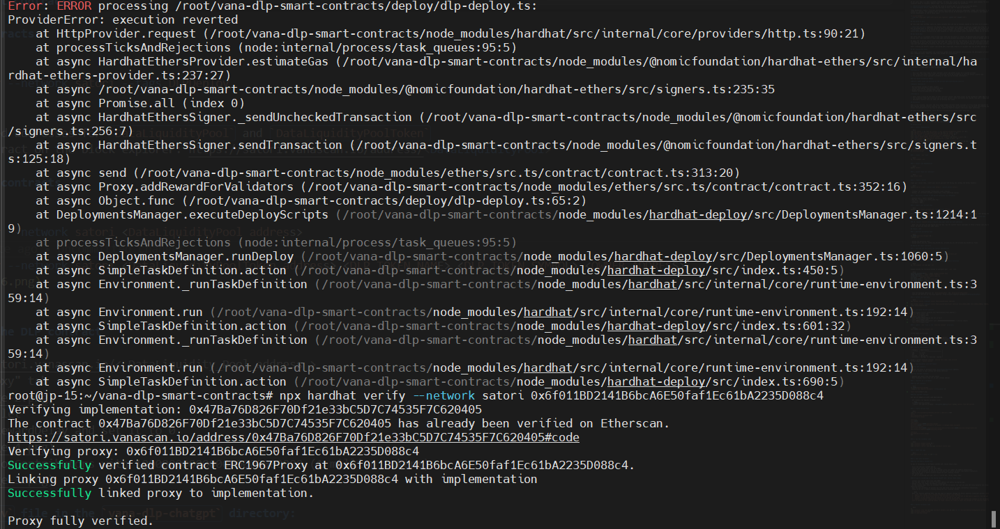
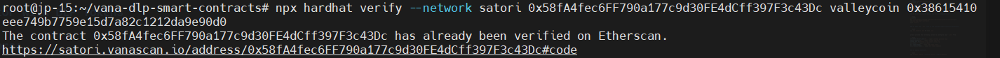
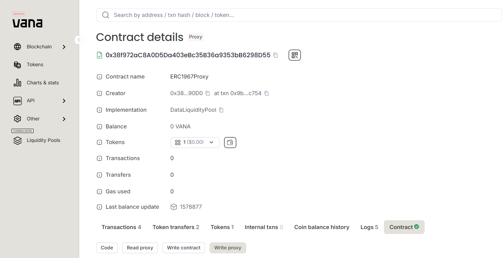
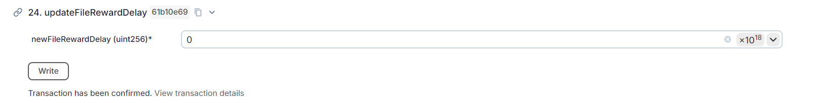
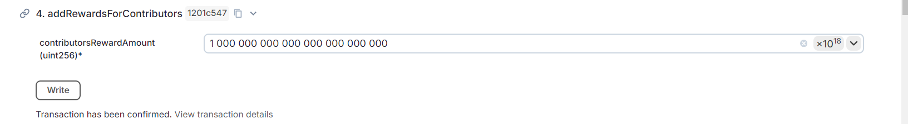

## Deploy DLP Smart Contracts

### 1. download and the binary and install dependencies

```bash
cd $HOME
git clone https://github.com/vana-com/vana-dlp-smart-contracts.git
cd vana-dlp-smart-contracts
yarn install
```

### 2. edit the `.env` file in the vana-dlp-smart-contracts directory

```bash
cp .env.example .env && nano .env
```

please provide the following values to configure your `.env` file

```bash
DEPLOYER_PRIVATE_KEY=0x... (your coldkey private key)
OWNER_ADDRESS=0x... (your coldkey address)
SATORI_RPC_URL=https://rpc.satori.vana.org
DLP_NAME=... (your DLP name)
DLP_TOKEN_NAME=... (your DLP token name)
DLP_TOKEN_SYMBOL=... (your DLP token symbol)
```

### 3. deploy contracts

```bash
npx hardhat deploy --network satori --tags DLPDeploy
```

- note the deployed addresses for `DataLiquidityPool` and `DataLiquidityPoolToken`
- confirm the contract on the block explorer: https://satori.vanascan.io/address/<DataLiquidityPool>

### 4. verify the contracts

```bash
npx hardhat verify --network satori <DataLiquidityPool address>
```


IGNORE THE ERROR

```bash
npx hardhat verify --network satori <DataLiquidityPoolToken address> <DLP_TOKEN_NAME> <DLP_TOKEN_SYMBOL> <OWNER_ADDRESS>
```



### 5. configure the DLP contract

- Visit https://satori.vanascan.io/< DataLiquidity_Pool_address >
- Go to "Write proxy" tab
  
- Connect your wallet
- Call updateFileRewardDelay and set it to 0
  
- Call addRewardsForContributors with 1000000000000000000000000 (1 million tokens)
  

### 6. update `.env` file in the `vana-dlp-chatgpt` directory:

```bash
nano $HOME/vana-dlp-chatgpt/.env
```

follow these instructions

```
-   DLP_SATORI_CONTRACT=0x... (DataLiquidityPool address)
-   DLP_TOKEN_SATORI_CONTRACT=0x... (DataLiquidityPoolToken address)
-   PRIVATE_FILE_ENCRYPTION_PUBLIC_KEY_BASE64=... (content of public_key_base64.asc)
-   DELETE THESE LINES:
        DLP_MOKSHA_CONTRACT=0xee4e3Fd107BE4097718B8aACFA3a8d2d9349C9a5
        DLP_SATORI_CONTRACT=0xa0519f5ADc4e82729b21Ef1586d397260D9B9E45
        DLP_TOKEN_MOKSHA_CONTRACT=0xF1925473bA6aa147EeB2529197C2704454D66b43
        DLP_TOKEN_SATORI_CONTRACT=0x3db29b7ED68Ca561794039B4D675f68fb64D6ac3
```

# [CONTINUE TO DLP VALIDATOR NODE](https://github.com/hubofvalley/Testnet-Guides/blob/main/Vana/DLP-validator-node.md)

### let's buidl together
