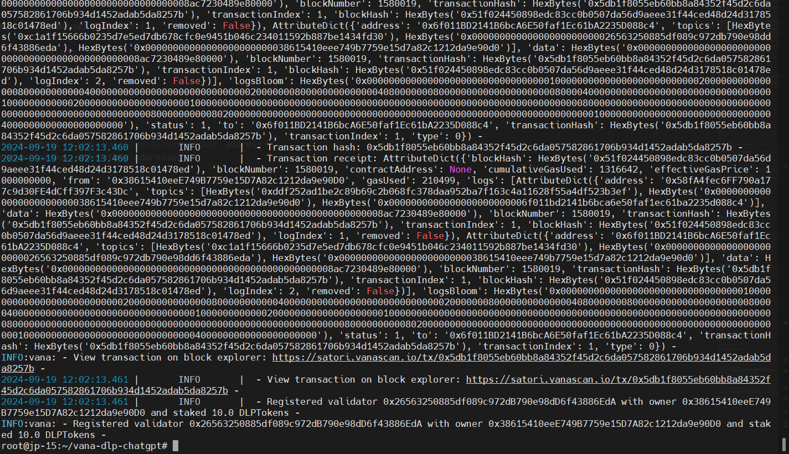
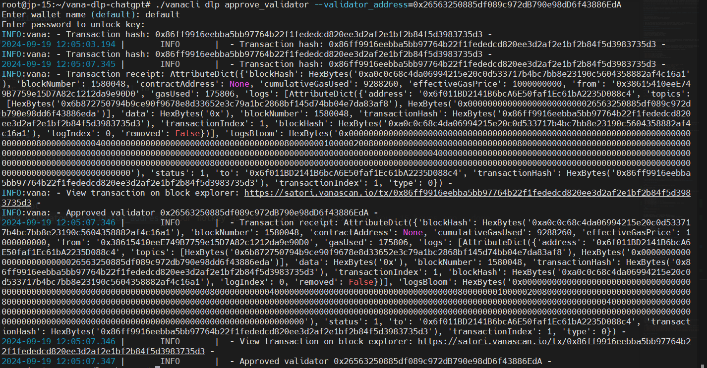
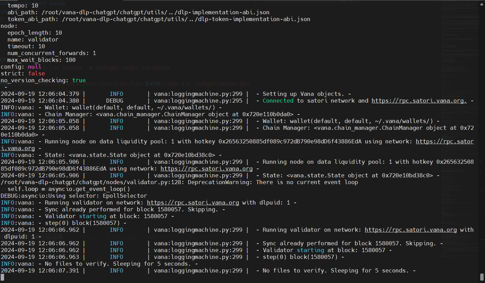

## Vana DLP Validator Node Deployment Guide

### **System Requirements**

| Category  | Requirements                   |
| --------- | ------------------------------ |
| CPU       | 2 cores                        |
| RAM       | 8+ GB                          |
| Storage   | 100 GB SSD                     |
| Bandwidth | 100 MBps for Download / Upload |

guide's current binaries version: `service file name: vana.service`
current chain : `satori testnet`

### 1. Fund Validator with DLP Tokens

#### For DLP creators:

- Import DLP token to Metamask using <DataLiquidityPoolToken address>
- Send 10 tokens to your coldkey and hotkey addresses

#### For non-DLP creators:

- Request DLP tokens from the DLP creator
- Once received, ensure they are in your coldkey address

### 2. register as a validator

#### For DLP creators:

```bash
cd $HOME/vana-dlp-chatgpt
./vanacli dlp register_validator --stake_amount 10
```



#### For non-DLP creators:

ASK THE DLP OWNER TO ACCEPT YOUR REGISTRATION.

- DLP creators can approve validators with:
  ```bash
  cd $HOME/vana-dlp-chatgpt
  ./vanacli dlp approve_validator --validator_address=<your hotkey address from EVM wallet>
  ```
  

### 3. create service file

```bash
sudo tee /etc/systemd/system/vana.service > /dev/null <<EOF
[Unit]
Description=Vana Validator Node
After=network.target

[Service]
User=$USER
Type=simple
WorkingDirectory=$HOME/vana-dlp-chatgpt
ExecStart=$HOME/.local/bin/poetry run python -m chatgpt.nodes.validator
Restart=on-failure
Environment=PATH=$HOME/.local/bin:/usr/local/bin:/usr/bin:/bin:$HOME/vana-dlp-chatgpt/myenv/bin
Environment=PYTHONPATH=$HOME/vana-dlp-chatgpt

[Install]
WantedBy=multi-user.target
EOF
```

### 4. run the validator node

```bash
sudo systemctl daemon-reload && \
sudo systemctl enable vana && \
sudo systemctl restart vana && sudo systemctl status vana
```

### 5. check the logs

```bash
sudo journalctl -u vana -fn 100
```



### 6. test your validator

#### For the Public ChatGPT DLP

If you're validating in the Public ChatGPT DLP, follow these steps:

- Visit the official [ChatGPT DLP UI](https://gptdatadao.org/claim).
- Connect your wallet (must hold some VANA).
- Follow the instructions on the UI to upload a file (to submit the addFile transaction).
- Wait for your validator to process the file and write scores on-chain (verifyFile transaction).
- Check the UI for a reward claiming dialog and test claiming rewards.

#### If you're validating in the Custom ChatGPT DLP, follow these steps:

- Visit the [demo DLP UI](https://dlp-ui.vercel.vana.com/claim/upload)
- Connect your wallet (must hold some VANA).
- Use the gear icon to set the DLP contract address and public encryption key.
- Upload a file (to submit the addFile transaction).
- In the console logs, note the uploaded file URL and encryption key (you can also add files manually via https://satori.vanascan.io/address/?tab=write_contract).
- Wait for your validator to process the file and write scores on-chain (verifyFile transaction).
- Check the UI for a reward claiming dialog and test claiming rewards.

  ```bash
  Note: For heavily modified DLPs, you may need to register through the Satori explorer using your wallet's browser extension:
  1.  Import your hotkey into a browser-compatible wallet like MetaMask.
  2.  Navigate to the Write proxy tab for the verified contract for the DLP in the Satori explorer. You can get this URL from the DLP owner.
  3.  Connect to your hotkey with the button at the bottom of the page.
  4.  Submit a validator registration transaction with the addresses of your hotkey and coldkey as the validator and validator owner addresses, along with an amount of the required tokens to stake. Ensure you stake at least the minimum of the specific token required by the DLP.
  ```

### 7. delete validator node

```bash
cd
sudo systemctl stop vana && sudo systemctl disable vana && sudo rm -rf /etc/systemd/system/0gchaind.service
sudo systemctl daemon-reload
sudo rm vana-dlp-chatgpt
```