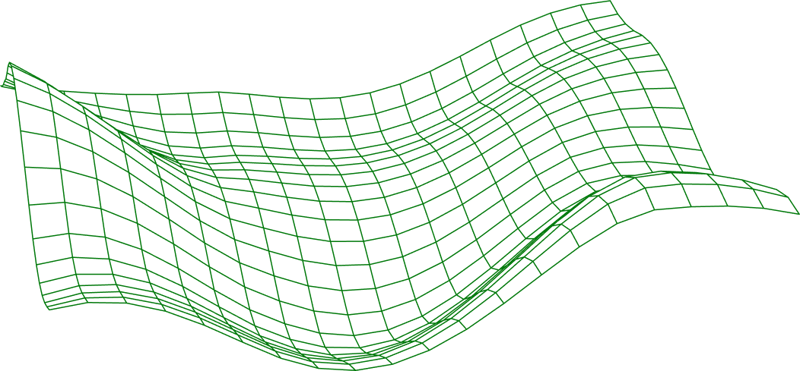

# Vana Testnet Guide

`will always update`

  

# Vana: Turning Data into Currency

## What Is Vana

Welcome to Vana! Vana turns data into currency to push the frontiers of decentralized AI. It is a layer one blockchain designed for private, user-owned data. Vana allows users to collectively own, govern, and earn from the AI models trained on their data. For more context on why we built Vana, see [this blog post](https://docs.vana.org/vana).

## Core Concepts

At its core, Vana is a data liquidity network. It makes data liquid by solving the double spend problem for data, ensuring that data can be used like a financial asset in flexible, modular ways. This is achieved through two mechanisms:

1. **Proof-of-Contribution**: Verifies the value of private data in a privacy-preserving manner.
2. **Non-Custodial Data**: Ensures that the data is only used for approved operations.

These mechanisms create a trustless environment where data can be securely tokenized, traded, and utilized for AI training without compromising user privacy or control. This paradigm shift not only democratizes AI development but also introduces a new economic model where data contributors become active stakeholders in the AI value chain.

  

## The Value of Data

We live under data serfdom, where we create valuable data and see no economic upside in the value we've helped create.

- **Big Tech and AI**: Companies like OpenAI, Meta, and Google train models on publicly scraped data from the searchable internet and are starting to buy up private data as they need access to more training data. For example, Reddit earns $200M from selling user-generated content as AI training data.
- **Economic Impact**: As AI starts to play a larger economic role in society, the economic impact of this data will grow. We risk heading towards a future where AI models trained on our data displace us, with the economic gains flowing to a small set of shareholders.

## Our North Star

Our north star is to empower users to own their data and the value it creates. We believe data will power the AI economic shift over the next decade. Giving users true ownership of their data opens up walled gardens and pushes AI progress forward through data abundance.

We apply the sovereign, decentralized technology that powers Bitcoin and Ethereum to personal data, shifting power from monopolistic big tech and distributing it back into the hands of the users who created the data. Vana provides the infrastructure to generate user-owned datasets that can replicate and supersede the datasets that big tech companies are today selling for hundreds of millions of dollars.

We’re creating the world's largest user-owned data treasury—a resource so valuable that the world’s leading AI models will be built upon it.

## Our Guiding Use Cases

With Vana, users and developers can incentivize global data contribution and accelerate the development of user-owned data applications, AI models, and data liquidity pools. These use cases have guided our architecture:

### User-Owned Data Treasury

**Incentivize 100 million people to export their Google, Facebook, Instagram, and Reddit data to create the first user-owned data treasury.**

**Network Features:**

- Non-custodial data storage
- Attributes voting rights based on data contributions
- Verifies the legitimacy of data to ensure quality

**Process:**

1. Each user adds their data to their personal server and grants access to a trusted verifier.
2. Users then contribute their data to a collective server by encrypting it with the server's public key.
3. The collective server operates according to rules set by the data contributors.

### User-Owned Foundation Models

**Build a model owned and governed by 100 million data-contributing users.**

**Network Features:**

- Non-custodial storage of model weights
- Secures distributed training on private data
- Allows users to earn through model usage
- Enables collective governance of the model

**Process:**

1. Users train a piece of the model on their personal servers and grant access to the foundation model DAO to merge all individual pieces.
2. The foundation model DAO evaluates the value each person's data contributes and rewards them with a model-specific token.
3. Developers interact with the model API by burning this token.

## Conclusion

Vana is the scalable, low-cost, and fully programmable solution that’s necessary to truly bring vast amounts of data on-chain. Its role as an on-chain data storage solution unlocks numerous use cases, providing the infrastructure for any on-chain data-related application. Vana efficiently stores and proves the availability of any type of data, extending benefits beyond traditional legal protection.

For more detailed information, visit the [Vana Documentation](https://docs.vana.org).

Join us and be part of the revolution!

- [Vana Website](https://www.vana.org)
- [Vana Twitter](https://x.com/withvana)
- [Vana Discord](https://discord.gg/withvana)
- [Vana Docs](https://docs.vana.org)
- [Vana GitHub Repository](https://github.com/vana-com)