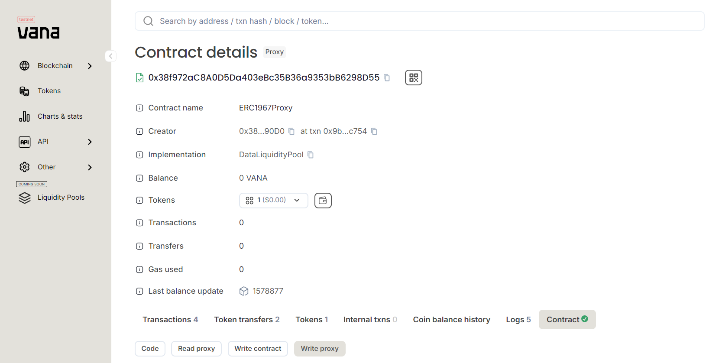

# Vana Testnet Guide

`will always update`

<p align="center">
  
</p>

# Vana: Turning Data into Currency

## What Is Vana

Welcome to Vana! Vana turns data into currency to push the frontiers of decentralized AI. It is a layer one blockchain designed for private, user-owned data. Vana allows users to collectively own, govern, and earn from the AI models trained on their data. For more context on why we built Vana, see [this blog post](https://docs.vana.org/vana).

## Core Concepts

At its core, Vana is a data liquidity network. It makes data liquid by solving the double spend problem for data, ensuring that data can be used like a financial asset in flexible, modular ways. This is achieved through two mechanisms:

1. **Proof-of-Contribution**: Verifies the value of private data in a privacy-preserving manner.
2. **Non-Custodial Data**: Ensures that the data is only used for approved operations.

These mechanisms create a trustless environment where data can be securely tokenized, traded, and utilized for AI training without compromising user privacy or control. This paradigm shift not only democratizes AI development but also introduces a new economic model where data contributors become active stakeholders in the AI value chain.

<p align="center">
  
</p>

## The Value of Data

We live under data serfdom, where we create valuable data and see no economic upside in the value we've helped create.

- **Big Tech and AI**: Companies like OpenAI, Meta, and Google train models on publicly scraped data from the searchable internet and are starting to buy up private data as they need access to more training data. For example, Reddit earns $200M from selling user-generated content as AI training data.
- **Economic Impact**: As AI starts to play a larger economic role in society, the economic impact of this data will grow. We risk heading towards a future where AI models trained on our data displace us, with the economic gains flowing to a small set of shareholders.

## Our North Star

Our north star is to empower users to own their data and the value it creates. We believe data will power the AI economic shift over the next decade. Giving users true ownership of their data opens up walled gardens and pushes AI progress forward through data abundance.

We apply the sovereign, decentralized technology that powers Bitcoin and Ethereum to personal data, shifting power from monopolistic big tech and distributing it back into the hands of the users who created the data. Vana provides the infrastructure to generate user-owned datasets that can replicate and supersede the datasets that big tech companies are today selling for hundreds of millions of dollars.

We’re creating the world's largest user-owned data treasury—a resource so valuable that the world’s leading AI models will be built upon it.

## Our Guiding Use Cases

With Vana, users and developers can incentivize global data contribution and accelerate the development of user-owned data applications, AI models, and data liquidity pools. These use cases have guided our architecture:

### User-Owned Data Treasury

**Incentivize 100 million people to export their Google, Facebook, Instagram, and Reddit data to create the first user-owned data treasury.**

**Network Features:**

- Non-custodial data storage
- Attributes voting rights based on data contributions
- Verifies the legitimacy of data to ensure quality

**Process:**

1. Each user adds their data to their personal server and grants access to a trusted verifier.
2. Users then contribute their data to a collective server by encrypting it with the server's public key.
3. The collective server operates according to rules set by the data contributors.

### User-Owned Foundation Models

**Build a model owned and governed by 100 million data-contributing users.**

**Network Features:**

- Non-custodial storage of model weights
- Secures distributed training on private data
- Allows users to earn through model usage
- Enables collective governance of the model

**Process:**

1. Users train a piece of the model on their personal servers and grant access to the foundation model DAO to merge all individual pieces.
2. The foundation model DAO evaluates the value each person's data contributes and rewards them with a model-specific token.
3. Developers interact with the model API by burning this token.

## Conclusion

Vana is the scalable, low-cost, and fully programmable solution that’s necessary to truly bring vast amounts of data on-chain. Its role as an on-chain data storage solution unlocks numerous use cases, providing the infrastructure for any on-chain data-related application. Vana efficiently stores and proves the availability of any type of data, extending benefits beyond traditional legal protection.

For more detailed information, visit the [Vana Documentation](https://docs.vana.org).

Join us and be part of the revolution!

- [Vana Website](https://www.vana.org)
- [Vana Twitter](https://x.com/withvana)
- [Vana Discord](https://discord.gg/withvana)
- [Vana Docs](https://docs.vana.org)
- [Vana GitHub Repository](https://github.com/vana-com)

## Setups guide

### 1. install dependencies

```bash
sudo apt update -y && sudo apt install -y git software-properties-common curl && \
sudo add-apt-repository ppa:deadsnakes/ppa && sudo apt update -y && \
sudo apt install -y python3.11 python3.11-venv python3.11-dev && \
curl -sSL https://install.python-poetry.org | python3.11 - && \
echo 'export PATH="$HOME/.local/bin:$PATH"' >> ~/.bashrc && source ~/.bashrc && \
curl -fsSL https://deb.nodesource.com/setup_18.x | sudo -E bash - && \
sudo apt install -y nodejs && \
git --version && python3.11 --version && poetry --version && node --version && npm --version
```

### 2. download binary

```bash
git clone https://github.com/vana-com/vana-dlp-chatgpt.git
cd vana-dlp-chatgpt
```

### 3. create `.env` file

```bash
cp .env.example .env
```

### 4. install app dependencies

```bash
poetry install
```

### 5. install Vana CLI (optional)

```bash
pip install vana
```

### 6. create a wallet

input your wallet name, create your wallet password and backup the coldkey and hotkey mnemonic

```bash
vanacli wallet create --wallet.name default --wallet.hotkey default
```

- Coldkey: for human-managed transactions (like staking)
- Hotkey: for validator-managed transactions (like submitting scores)

### 7. add Satori Testnet to EVM Wallet Extension (i.e Metamask)

| Network name | Satori Testnet |
| RPC URL | https://rpc.satori.vana.org |
| Chain ID | 14801 |
| Currency | VANA |

### 8. export your private keys

```bash
vanacli wallet export_private_key  --wallet.name default
```

enter `coldkey` then backup the coldkey's private key. execute the command again, enter `hotkey` then backup the hotkey's private key

### 9. import both your coldkey and hotkey addresses into the EVM wallet extension using their private keys

save those addresses

### 10. request [faucet](https://faucet.vana.org) funds for both addresses

- Note: you can only use the faucet once per day. Use the testnet faucet available at https://faucet.vana.org to fund your wallets, or ask a VANA holder to send you some test VANA tokens.

## Create a DLP

### 1. generate encryption keys

```bash
cd $HOME/vana-dlp-chatgpt/ && \
./keygen.sh
```

- backup the generated keys
- backup public_key.asc, public_key_base64.asc, private_key.asc and private_key_base64.asc files

## Deploy DLP Smart Contracts

### 1. download and the binary and install dependencies

```bash
cd $HOME
git clone https://github.com/vana-com/vana-dlp-smart-contracts.git
cd vana-dlp-smart-contracts
yarn install
```

### 2. edit the `.env` file in the vana-dlp-smart-contracts directory

```bash
cp .env.example .env && nano .env
```

please provide the following values to configure your `.env` file

```bash
DEPLOYER_PRIVATE_KEY=0x... (your coldkey private key)
OWNER_ADDRESS=0x... (your coldkey address)
SATORI_RPC_URL=https://rpc.satori.vana.org
DLP_NAME=... (your DLP name)
DLP_TOKEN_NAME=... (your DLP token name)
DLP_TOKEN_SYMBOL=... (your DLP token symbol)
```

### 3. deploy contracts

```bash
npx hardhat deploy --network satori --tags DLPDeploy
```

- note the deployed addresses for `DataLiquidityPool` and `DataLiquidityPoolToken`
- confirm the contract on the block explorer: https://satori.vanascan.io/address/<DataLiquidityPool>

### 4. verify the contracts

```bash
npx hardhat verify --network satori <DataLiquidityPool address>
npx hardhat verify --network satori <DataLiquidityPoolToken address> <DLP_TOKEN_NAME> <DLP_TOKEN_SYMBOL> <OWNER_ADDRESS>
```

### 5. configure the DLP contract

- Visit https://satori.vanascan.io/< DataLiquidity_Pool_address >
- Go to "Write proxy" tab
  
- Connect your wallet
- Call updateFileRewardDelay and set it to 0
- Call addRewardsForContributors with 1000000000000000000000000 (1 million tokens)

### 6. update `.env` file in the `vana-dlp-chatgpt` directory:

```bash
nano $HOME/vana-dlp-chatgpt/.env
```

follow these instructions

```
DLP_SATORI_CONTRACT=0x... (DataLiquidityPool address)
DLP_TOKEN_SATORI_CONTRACT=0x... (DataLiquidityPoolToken address)
PRIVATE_FILE_ENCRYPTION_PUBLIC_KEY_BASE64=... (content of public_key_base64.asc)
```

## Vana Validator Node Deployment Guide

### **System Requirements**

| Category  | Requirements                   |
| --------- | ------------------------------ |
| CPU       | 2 cores                        |
| RAM       | 8+ GB                          |
| Storage   | 100 GB SSD                     |
| Bandwidth | 100 MBps for Download / Upload |

guide's current binaries version: `service file name:`
current chain : `satori testnet`

### 1. Fund Validator with DLP Tokens

#### For DLP creators:

- Import DLP token to Metamask using <DataLiquidityPoolToken address>
- Send 10 tokens to your coldkey and hotkey addresses

#### For non-DLP creators:

- Request DLP tokens from the DLP creator
- Once received, ensure they are in your coldkey address

### 2. register as a validator

#### For DLP creators:

```bash
cd $HOME/vana-dlp-chatgpt
./vanacli dlp register_validator --stake_amount 10
```

#### For non-DLP creators:

ASK THE DLP OWNER TO ACCEPT YOUR REGISTRATION.

- DLP creators can approve validators with:
  ```bash
  cd $HOME/vana-dlp-chatgpt
  ./vanacli dlp approve_validator --validator_address=<your hotkey address from EVM wallet>
  ```

### 3. create service file

```bash
sudo tee /etc/systemd/system/vana.service > /dev/null <<EOF
[Unit]
Description=Vana Validator Node
After=network.target

[Service]
User=$USER
Type=simple
WorkingDirectory=$HOME/vana-dlp-chatgpt
ExecStart=$HOME/.local/bin/poetry run python -m chatgpt.nodes.validator
Restart=on-failure
Environment=PATH=$HOME/.local/bin:/usr/local/bin:/usr/bin:/bin:$HOME/vana-dlp-chatgpt/myenv/bin
Environment=PYTHONPATH=$HOME/vana-dlp-chatgpt

[Install]
WantedBy=multi-user.target
EOF
```

### 4. run the validator node

```bash
sudo systemctl daemon-reload && \
sudo systemctl enable vana && \
sudo systemctl restart vana && sudo systemctl status vana
```

### 5. check the logs

```bash
sudo journalctl -u vana -fn 100 -o cat
```

### 6. test your validator

#### For the Public ChatGPT DLP

If you're validating in the Public ChatGPT DLP, follow these steps:

- Visit the official ChatGPT DLP UI.
- Connect your wallet (must hold some VANA).
- Follow the instructions on the UI to upload a file (to submit the addFile transaction).
- Wait for your validator to process the file and write scores on-chain (verifyFile transaction).
- Check the UI for a reward claiming dialog and test claiming rewards.
- For Custom DLPs
- If you're validating with your own or a custom DLP, follow these steps:

#### If you're validating in the Custom ChatGPT DLP, follow these steps:

- Connect your wallet (must hold some VANA).
- Use the gear icon to set the DLP contract address and public encryption key.
- Upload a file (to submit the addFile transaction).
- In the console logs, note the uploaded file URL and encryption key (you can also add files manually via https://satori.vanascan.io/address/?tab=write_contract).
- Wait for your validator to process the file and write scores on-chain (verifyFile transaction).
- Check the UI for a reward claiming dialog and test claiming rewards.

  ```bash
  Note: For heavily modified DLPs, you may need to register through the Satori explorer using your wallet's browser extension:
  1.  Import your hotkey into a browser-compatible wallet like MetaMask.
  2.  Navigate to the Write proxy tab for the verified contract for the DLP in the Satori explorer. You can get this URL from the DLP owner.
  3.  Connect to your hotkey with the button at the bottom of the page.
  4.  Submit a validator registration transaction with the addresses of your hotkey and coldkey as the validator and validator owner addresses, along with an amount of the required tokens to stake. Ensure you stake at least the minimum of the specific token required by the DLP.
  ```

### 7. delete validator node

```bash
cd
sudo systemctl stop vana && sudo systemctl disable vana && sudo rm -rf /etc/systemd/system/0gchaind.service
sudo systemctl daemon-reload
sudo rm vana-dlp-chatgpt
```
